# **Software Design Document: RTLS Analytics Platform**

## **1. Introduction**

### **1.1. Purpose**

This document details the system's architecture, data models, component interactions, and key implementation strategies. This document is intended for the in-house development team to guide the implementation, testing, and deployment of the system.

### **1.2. Scope**

This design covers the four primary tiers of the RTLS system: the backend microservices (Ingestion, API, Analytics), the database layer, the frontend web application, and the cross-platform mobile application. It translates the functional and non-functional requirements into a concrete technical implementation plan.

---

## **2. System Architecture Overview**

The system will be implemented using a microservices architecture, containerized with Docker, and orchestrated by Kubernetes. This approach ensures scalability, resilience, and maintainability.

### **2.1. Architectural Diagram (Container View)**

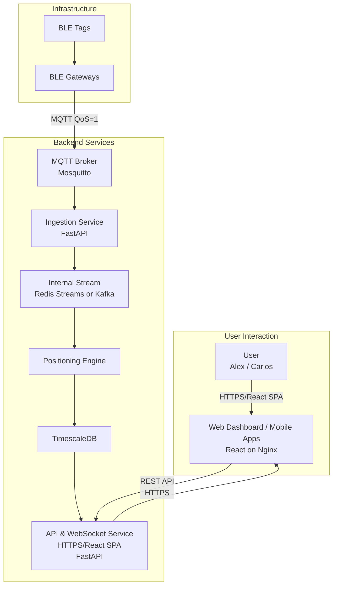

### 2.2 **Components**

- **BLE Tags (beacons)**: emit advertisements at configured intervals.
- **BLE Gateways**: publish JSON to MQTT topics (QoS=1). Minimal capabilities assumed.
- **MQTT Broker**: TLS, per-topic ACLs.
- **Ingestion Service (FastAPI)**: subscribes to topics, validates payloads, dedupes, tags with `broker_received_timestamp`, writes to TimescaleDB and streams data to Positioning Engine.
- **Positioning Engine**: computes positions and stores `location_history`.
- **API & WS Service (FastAPI)**: authentication, REST APIs, WebSocket streaming.
- **Redis**: dedupe cache, pub/sub/streams, job coordination.
- **TimescaleDB**: primary storage for readings and locations.

### 2.3 **Message sequence**

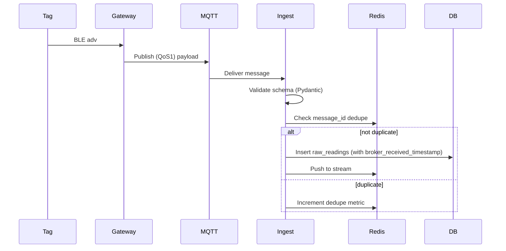

---

## **3. Backend Design**

### **3.1. Gateway Communication Layer**

- **Protocol:** MQTT
- **MQTT Topic Structure:**
  - telemetry: `rtls/data/{gateway_id}`
  - heartbeat: `rtls/heartbeat/{gateway_id}`
- **Identity Rule:** The topic gateway identifier must match the payload `gateway_id` and an existing registered gateway.
- **Payload Format (JSON):** Each telemetry message published by a gateway contains one message envelope and one or more observed tag readings.

    ```json
    {
      "gateway_id": "gw-01-lobby",
      "message_id": "msg-001",
      "gateway_timestamp": "2026-03-25T18:30:00Z",
      "firmware_version": "1.4.0",
      "readings": [
        { "tag_id": "A1:B2:C3:D4:E5:F6", "rssi": -65, "tx_power": -8, "channel": 37 },
        { "tag_id": "B2:C3:D4:E5:F6:A1", "rssi": -72 }
      ]
    }
    ```

- **Heartbeat Format (JSON):** Each heartbeat publishes latest-known gateway liveness metadata without location computation.

    ```json
    {
      "gateway_id": "gw-01-lobby",
      "message_id": "hb-001",
      "gateway_timestamp": "2026-03-25T18:30:05Z",
      "firmware_version": "1.4.0",
      "battery_level_percent": 88
    }
    ```

### **3.2. Data Ingestion & Positioning Service**

- **Language/Framework:** Python worker process.
- **Core Logic:**
    1. The worker subscribes to `rtls/data/+` and `rtls/heartbeat/+`.
    2. Each message is parsed and validated before any durable state is written.
    3. The worker verifies that the MQTT topic gateway identifier matches the payload `gateway_id` and a registered gateway record.
    4. The worker deduplicates MQTT retries using the tuple `(gateway_id, message_id)` in Redis with a 10-second TTL.
    5. Accepted telemetry is persisted as one `raw_readings` row per observed tag with `broker_received_at` as canonical time.
    6. Accepted heartbeat messages update the `gateway_heartbeats` latest-known state used by backend operational feeds.

#### MQTT payload schema (canonical)

```json
{
  "$schema": "http://json-schema.org/draft-07/schema#",
  "title": "gateway_ble_reading",
  "type": "object",
  "required": ["gateway_id", "message_id", "readings"],
  "properties": {
    "gateway_id": {"type": "string"},
    "message_id": {"type": "string"},
    "gateway_timestamp": {"type": "string", "format": "date-time"},
    "firmware_version": {"type": "string"},
    "site_id": {"type": "string"},
    "readings": {
      "type": "array",
      "items": {"type": "object", "required": ["tag_id","rssi"], "properties": {"tag_id":{"type":"string"},"rssi":{"type":"integer"},"tx_power":{"type":"integer"},"channel":{"type":"integer"}}}
    }
  }
}
```

#### Ingestion rules

- QoS = 1 for MQTT publishes.
- Ingestion appends `broker_received_at` (UTC) and uses it as canonical time.
- Deduplicate by `(gateway_id, message_id)` using Redis with a 10-second TTL.
- Gateway-provided `gateway_timestamp` remains optional metadata and never replaces canonical time.
- Unknown gateways, topic/payload mismatches, invalid payloads, and duplicate retries are rejected before durable writes.
- The current economic-tier baseline derives latest known asset locations and append-only location history from recent accepted raw readings on mapped floors.

#### Key operational notes

- **Time canonicalization:** The ingestion worker appends `broker_received_at` to every message and uses it as canonical time. Gateway-provided `gateway_timestamp` is optional and treated as best-effort metadata.
- **Broker & security:** Use a broker supporting TLS and per-topic ACLs (EMQX, Mosquitto with auth plugin, or HiveMQ). Gateways should authenticate using client certs or unique credentials.
- **Economic-tier positioning baseline:** The worker reuses recent accepted raw readings plus registered gateway placements to compute confidence-aware floor locations. Low-confidence outputs fall back to mapped zones when possible instead of implying point precision.
- **Reference data note:** Guided radiomap collection remains deferred to the later mobile calibration change. The delivered baseline relies on backend-managed floor, zone, and gateway-placement data.
- **Remaining scope boundary:** Alerts, analytics rollups, premium-tier telemetry, and mobile calibration workflows remain out of scope for this baseline.
- **No gateway scraping or local buffering:** Do not expect Prometheus scraping or persistent queues on commercial Tuya gateways. For full gateway control choose alternative hardware.

### **3.3. API Service**

- **Language/Framework:** Python with FastAPI REST Framework.
- **Security:** Stateless **JSON Web Tokens (JWT)**. The flow includes short-lived access tokens and long-lived refresh tokens.
  - OAuth2 Authorization Code + PKCE for SPAs and mobile.
  - JWT access tokens (10 min), refresh tokens (7 days, rotated), session store in Redis for revocation.
  - Gateways: client-certs preferred; else per-gateway username/password. Broker enforces TLS and ACLs.
- **API Endpoint Specification:**

| Resource | Method | Path | Description |
| :--- | :--- | :--- | :--- |
| **Authentication** | `POST` | `/api/token` | Authenticates user with credentials, returns access/refresh tokens. |
| | `POST` | `/api/token/refresh` | Obtains a new access token using a valid refresh token. |
| **Live Locations** | `GET` | `/api/locations/live` | Returns the latest known live locations with supported site, floor, asset, and confidence filters. |
| | `GET` | `/api/locations/search` | Searches tracked assets and returns the latest known location context for matches. |
| | `GET` | `/api/locations/assets/{asset_tag_id}/history` | Returns durable location history for a selected asset and time range. |
| **Assets** | `GET` | `/api/assets` | Retrieves a paginated list of all assets. Supports filtering by type. |
| | `POST` | `/api/assets` | Creates a new asset (US-ADM-04). |
| | `GET` | `/api/assets/{id}` | Retrieves details for a single asset. |
| | `PUT` | `/api/assets/{id}` | Updates details for a single asset. |
| | `DELETE` | `/api/assets/{id}` | Deletes an asset. |
| | `POST` | `/api/assets/bulk_import` | Imports assets from a CSV file (US-ADM-05). |
| **Admin - Gateway Health** | `GET` | `/api/admin/gateway-health` | Returns the latest heartbeat state for registered gateways that have reported health data. |
| **Analytics** | `GET` | `/api/analytics/trajectory` | Retrieves historical location points for an asset within a time range (US-ANL-01). |
| | `GET` | `/api/analytics/heatmap` | Retrieves aggregated data for heatmap visualization (US-ANL-04). |
| | `GET` | `/api/analytics/visit_count` | Retrieves a report of visits to specified POIs by an asset (US-ANL-03). |
| **Admin - Gateways** | `GET` | `/api/gateways` | Retrieves a list of all configured gateways. |
| | `POST` | `/api/gateways` | Registers a new gateway and its location (US-ADM-02). |
| | `PUT` | `/api/gateways/{id}` | Updates a gateway's configuration. |
| **Admin - Zones & POIs** | `GET` | `/api/zones` | Retrieves a list of all geofences and Points of Interest. |
| | `POST` | `/api/zones` | Creates a new geofence or POI (US-ANL-02). |
| | `PUT` | `/api/zones/{id}` | Updates a zone's geometry or name. |
| **Data Export** | `POST` | `/api/export/request` | Requests an async export of raw data. Returns a job ID. |
| | `GET` | `/api/export/status/{job_id}` | Checks the status of an export job and provides a download URL when complete. |
| **Real-time** | `WS` | `/ws/locations` | WebSocket endpoint for streaming real-time location updates. |

### **3.4. Analytics & Inference Service**

- **Implementation:** A set of scheduled tasks managed by a job queue like **Celery** with a scheduler like Celery Beat.
- **Core Jobs:**
  - **Data Aggregation (Nightly):** Purges raw data older than 90 days after creating permanent hourly summaries.
  - **Insight Generation (Scheduled):** Populates the `analytics_insights` table with actionable information.

---

## **4. Database Design**

- **System:** PostgreSQL with the TimescaleDB extension.
- **Key Schemas:**
  - **`assets`**:
    - `id` (PK),
    - `tag_id` (VARCHAR, UNIQUE),
    - `name` (VARCHAR),
    - `type` (VARCHAR).
  - **`sites`**:
    - `id` (PK),
    - `name` (VARCHAR),
    - `type` (VARCHAR).
  - **`gateways`**:
    - `id` (PK),
    - `name` (VARCHAR),
    - `site_id` (VARCHAR, UNIQUE),
    - `location_x` (FLOAT),
    - `location_y` (FLOAT).
  - **`raw_readings`** (TimescaleDB Hypertable):
    - `id` (PK),
    - `message_id`  (INTEGER, UNIQUE),
    - `broker_received_timestamp` (TIMESTAMPTZ),
    - `gateway_timestamp` (TIMESTAMPTZ),
    - `firmware_version` (VARCHAR),
    - `rssi` (INTEGER),
    - `readings` (JSONB),
    - `asset_id` (FK to assets),
    - `gateway_id` (FK to gateways).
  - **`asset_current_locations`**:
    - `asset_id` (PK / FK to assets),
    - `floor_id` (FK to floors),
    - `zone_id` (nullable FK to zones),
    - `observed_at` (TIMESTAMPTZ),
    - `location_type` (`point` or `zone`),
    - `location_x` (FLOAT, nullable),
    - `location_y` (FLOAT, nullable),
    - `confidence_level` (VARCHAR),
    - `confidence_score` (FLOAT).
  - **`location_history`** (TimescaleDB Hypertable / append-only history pattern):
    - `id` (PK),
    - `timestamp` (TIMESTAMPTZ),
    - `location_x` (FLOAT),
    - `location_y` (FLOAT).
    - `asset_id` (FK to assets),
    - `zone_id` (nullable FK to zones),
    - `confidence_level` (VARCHAR),
    - `confidence_score` (FLOAT).
- **Data Lifecycle Management:**
  - A TimescaleDB **retention policy** will automatically delete raw data older than **90 days**.
  - Rollups: hourly/daily tables for dwell time, zone counts, avg_rssi

### **Data Model (Entity-Relationship Diagram)**

This diagram illustrates the primary database tables and their relationships.

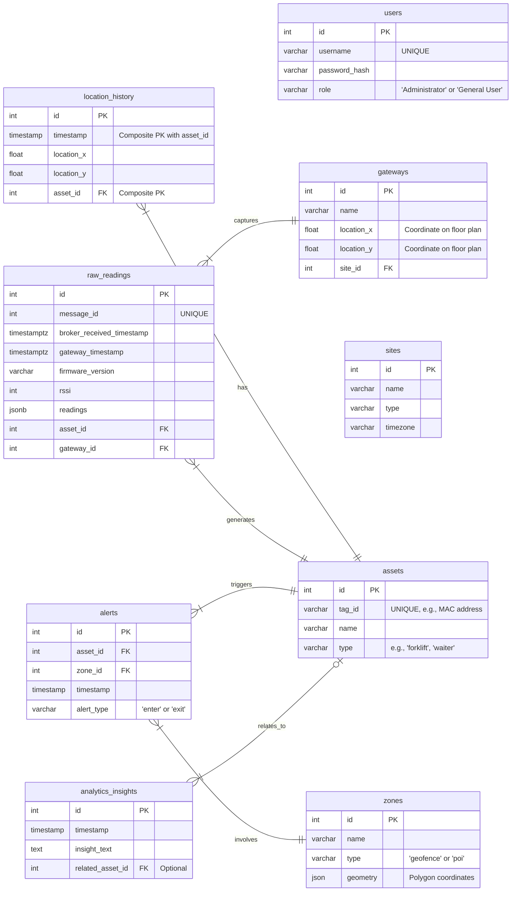

### **Explanation of Relationships:**

- **`assets` to `location_history` (One-to-Many):** Each asset can have a long history of calculated locations.
- **`assets` to `raw_readings` (One-to-Many):** Each asset's tag generates many raw signal readings.
- **`gateways` to `raw_readings` (One-to-Many):** Each gateway captures many raw signal readings from various assets.
- **`assets` and `zones` to `alerts` (Many-to-Many via `alerts` table):** An asset can trigger alerts in multiple zones, and a zone can have alerts from multiple assets. The `alerts` table links them.
- **`assets` to `analytics_insights` (One-to-Many, Optional):** An analytical insight might be related to a specific asset, but it could also be a system-wide observation.

---

## **5. Frontend Design**

- **Framework:** React.js (using Vite for the build tool).
- **State Management:** **Zustand**.
- **Key Components:** `MapView`, `DashboardView`, `AnalyticsPanel`, `AdminPanel`.

### **5.1. General User Flow Diagram**

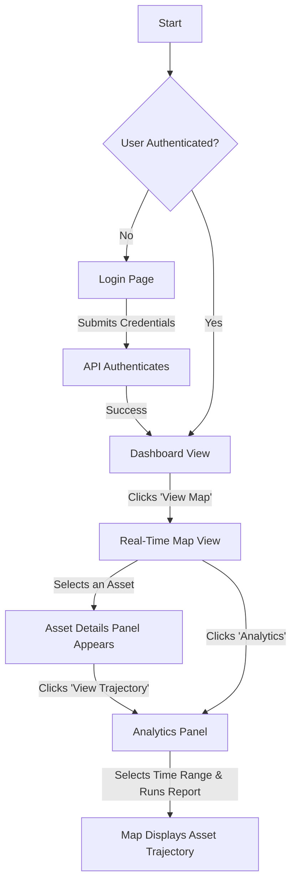

---

## **6. Mobile Application Design**

- **Framework:** A cross-platform framework like **Flutter** or **React Native**.
- **Core Logic:** On-device pathfinding using the **A* (A-star) algorithm** with a pre-downloaded map graph.

---

## **7. Sequence Diagrams**

### **7.1. Real-Time Map View Update**

This diagram shows how a beacon's signal results in an icon moving on the user's screen.

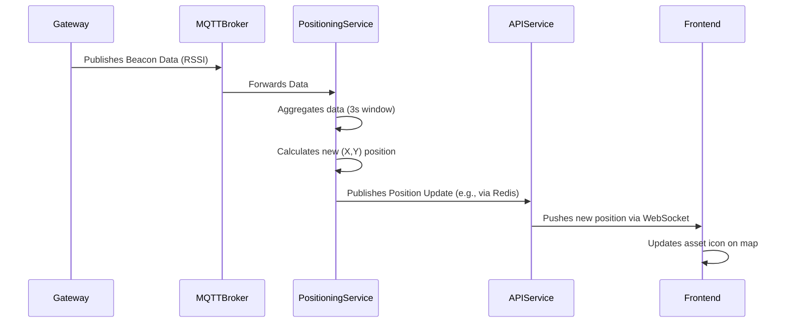

### **7.2. Generating a Trajectory Report**

This diagram illustrates the flow for fulfilling user story US-ANL-01.

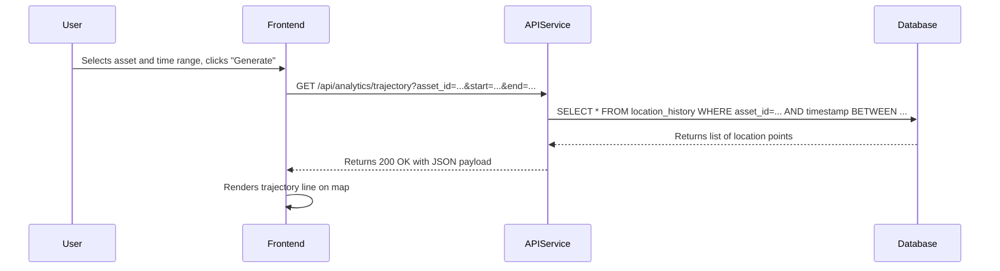

### **7.3. Administrator Adds a New Asset**

This diagram illustrates the flow for fulfilling user story US-ADM-04.

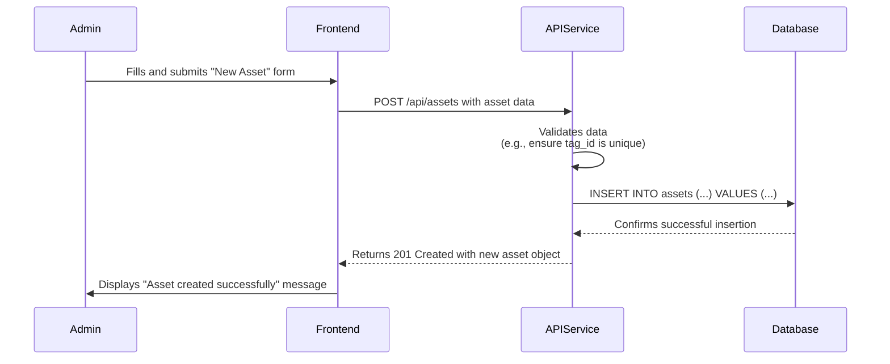

### 7.4. Calibration Mode

The mobile app runs a guided calibration that uses server-derived coverage heatmaps.

Steps:

1. Register site and start calibration.
2. Carry a calibration beacon/tag and walk the area; app streams actions to server and receives coverage updates.
3. App displays coverage heatmap and completion metrics derived from `broker_received_timestamp`.

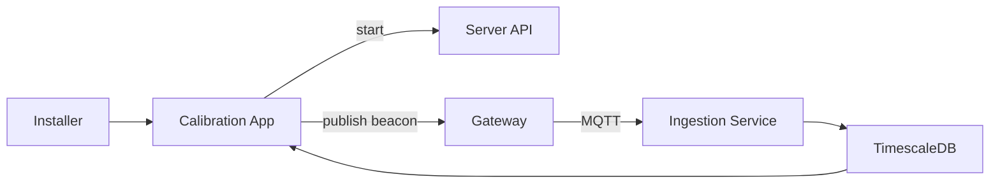

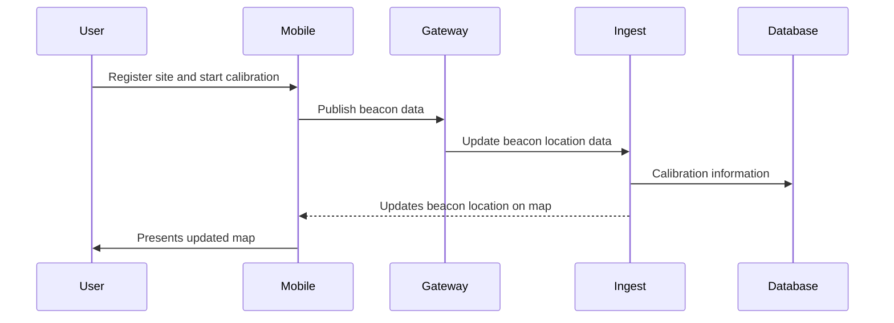

### 7.5. Onboarding Wizard

Admin registers gateways (gateway_id, location label, firmware) in the UI. Gateway metadata is used for mapping and diagnostics.

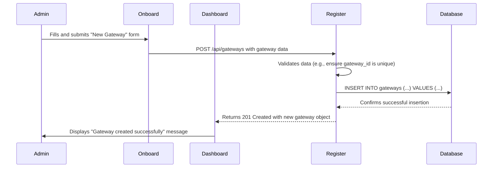

## **8. Testing Strategy**

A multi-layered testing strategy will be implemented to ensure code quality, service reliability, and correctness of the user experience.

### **8.1. Unit Testing**

- **Objective:** To verify the correctness of individual functions, classes, and components in isolation.
- **Backend (Python):**
  - **Framework:** `pytest`.
  - **Scope:**
    - Pure functions within the **Positioning Service**, such as the WCL algorithm implementation and data aggregation logic.
    - API endpoint serializers and data validation rules in the **API Service**.
    - Business logic within the **Analytics Service**, such as insight generation rules.
- **Frontend (React):**
  - **Frameworks:** `Jest` and `React Testing Library`.
  - **Scope:**
    - Individual React components (e.g., `AssetDetailsPanel`, `FilterDropdown`).
    - Custom hooks and state management logic (Zustand stores).
    - Utility functions (e.g., date formatting, data transformation).

### **8.2. Integration Testing**

- **Objective:** To verify the interactions and data flow between microservices and the database.
- **Framework:** `Docker Compose` will be used to create an isolated test environment.
- **Scope:**
  - **Positioning Pipeline:** A test will publish a mock MQTT message and assert that the correct `location_history` record is created in the test database.
  - **API-Database Interaction:** Tests will cover the full lifecycle of API calls, ensuring that a `POST` to `/api/assets` correctly creates a record and a subsequent `GET` retrieves it.
  - **Inter-service Communication:** Tests will verify that events published by the Positioning Service (e.g., via Redis Pub/Sub) are correctly received and handled by the API Service.

### **8.3. End-to-End (E2E) Testing**

- **Objective:** To validate complete user flows from the perspective of the user, ensuring the entire system works together as expected.
- **Framework:** `Cypress` or `Playwright`.
- **Scope:**
  - **Admin Setup Flow:** A test will simulate an Administrator logging in, uploading a floor plan, creating a gateway, and bulk-importing assets.
  - **Analytics Flow:** A test will simulate a General User logging in, navigating to the map, selecting an asset, and successfully generating a trajectory report for the last 24 hours.
  - **Real-time Update Flow:** A test will verify that when the backend receives new location data, the corresponding asset icon on the map updates its position within the specified 5-second latency window.

---

## **9. Deployment & CI/CD**

A continuous integration and continuous deployment pipeline will be established to automate the process of building, testing, and deploying the application to the Kubernetes cluster. Following is the Deployment architecture diagram

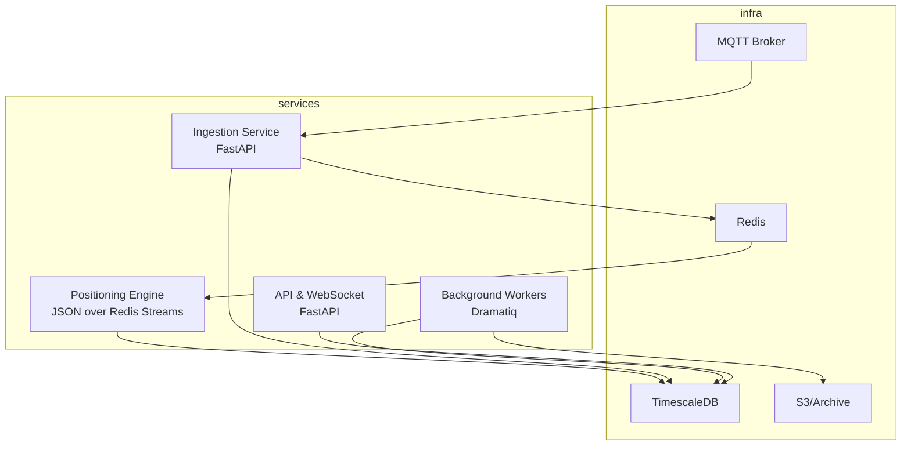

### **9.1. Source Control & CI Trigger**

- **Repository:** A monorepo or multiple repositories hosted on Git (e.g., GitHub).
- **Trigger:** The CI pipeline will be triggered automatically on every push to the `main` branch or on the creation of a pull request against `main`.

### **9.2. Continuous Integration (CI) Pipeline**

The pipeline will execute the following steps for each relevant service:

1. **Lint & Analyze:** Run static code analysis to check for code quality and potential bugs.
2. **Test:** Execute all unit and integration tests. A failing test will fail the pipeline.
3. **Build Docker Image:** If tests pass, a new Docker image will be built for the service.
4. **Tag Image:** The image will be tagged with the Git commit hash for traceability.
5. **Push to Registry:** The tagged image will be pushed to a private container registry (e.g., Docker Hub, Google Container Registry).

### **9.3. Continuous Deployment (CD) Pipeline**

- **Deployment checklist:**
  - Provision MQTT broker with TLS and ACLs.
  - Deploy Redis for dedupe and streaming (or Kafka if high throughput).
  - Deploy FastAPI ingestion service and Positioning Engine.
  - Deploy TimescaleDB and set retention/rollup policies.
  - Configure monitoring (Prometheus + Grafana) for services only.
- **Strategy:** A GitOps approach using a tool like **Argo CD** is recommended for managing deployments.
- **Workflow:**
    1. A separate Git repository will hold the Kubernetes YAML manifests for all services.
    2. After the CI pipeline successfully pushes a new Docker image, a step will automatically update the corresponding Deployment manifest in the GitOps repository with the new image tag.
    3. Argo CD, running in the Kubernetes cluster, will detect the change in the GitOps repository.
    4. Argo CD will automatically apply the updated manifest to the cluster, triggering a **rolling update** of the service. This ensures zero-downtime deployments.
