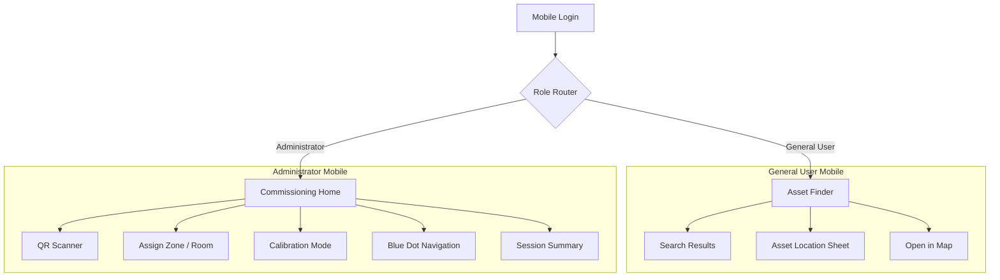

# **UX Design & User Stories: RTLS Analytics Platform**

## **1. Introduction**

### **1.1. Project Vision**

To create an intuitive, powerful, and reliable Real-Time Location System (RTLS) Analytics Platform for **restaurants and large catering operations**. The system empowers Operations Managers to move beyond simple asset tracking, unlocking actionable intelligence on service SLAs, staff round-trips, and kitchen bottlenecks.

### **1.2. Core UX Goals**

* **Clarity & Confidence:** Display clear data visualization including "Confidence Scores" so users know when tracking is pinpoint accurate versus zone-level.
* **Effortless Analytics:** Generating reports (Heatmaps, Round-Trip Times, Table SLAs) must be an intuitive, step-by-step process.
* **Seamless Cross-Platform:** Consistent experience across the web dashboard and the mobile commissioning/navigation app.

---

## **2. Personas**

There are two primary personas guiding the design and functionality of the project.

### **2.1. The Administrator**

| **Name** | **Alex (The Setup Guru)** |
| :--- | :--- |
| **Role** | IT / Systems Administrator |
| **Personality** | Meticulous, detail-oriented, and pragmatic. Alex values precision and reliability above all else. |
| **Core Goal** | To ensure the RTLS platform is a trustworthy source of truth for restaurant and catering operations. The data must be accurate, the hardware must be reliable, and the system must be stable. |
| **Motivations** | - Setting up a system that "just works" without constant firefighting.<br>- Empowering operational teams with data they can trust.<br>- Preventing "garbage in, garbage out" by ensuring precise calibration. |
| **Frustrations** | - Vague setup instructions.<br>- Systems that require constant manual adjustments.<br>- Inaccurate data that undermines user confidence. |
| **Quote** | *"If the data isn't accurate, the entire system is useless. My job is to make sure we can trust every single data point."* |

### **2.2. The General User**

| **Name** | **Carlos Mendes (The Operations Manager)** |
| :--- | :--- |
| **Role** | Operations Manager (e.g., Restaurant General Manager, Catering Operations Director) |
| **Personality** | Strategic, results-driven, and busy. Carlos needs to see the big picture quickly but also needs the ability to investigate anomalies. |
| **Core Goal** | To use location data to make smarter operational decisions that improve efficiency, enhance customer experience, and reduce costs. |
| **Motivations** | - Quickly understanding staff and asset movement patterns.<br>- Tracking service SLAs, table round trips, and kitchen bottlenecks.<br>- Proactively addressing issues before they become major problems. |
| **Frustrations** | - Drowning in raw data without clear insights.<br>- Spending too much time searching for assets or people.<br>- Not having concrete evidence to back up operational changes. |
| **Quote** | *"Don't just show me dots on a map. Show me what it means. How can I use this information to run my business better today?"* |

---

## **3. User Story Map & Flows**

This section organizes our features into a narrative flow, combining the user stories with real-world scenarios.

### **3.1. Activity 1: System Setup & Configuration (Alex)**

*As Alex, I need to set up the physical and digital environment flawlessly to ensure data accuracy.*

**Narrative Flow:**
* **Scenario:** An extension to the dining hall has been built. Alex needs to bring new BLE gateways online and establish the baseline.
* **Steps:** App Commissioning Mode → Scans Gateway QR → Selects "Dining Extension" zone → Mounts gateway → Taps "Start Data Collection" → Walks through the new dining room for 15 minutes → App generates the radiomap offsets automatically.

**Acceptance Criteria:**
| ID | User Story | Confirmation | Priority |
| :--- | :--- | :--- | :--- |
| **US-ADM-01** | As **Alex**, I want to upload a floor plan image, so that I have a visual canvas for my gateway and asset layout. | User can select image; displayed as background; scale is set via reference points. | **Must-have** |
| **US-ADM-02** | As **Alex**, I want to place and label gateway icons (Economic/Premium tier) on the map. | Drag/drop gateways; enter name/ID and tier. | **Must-have** |
| **US-ADM-03** | As **Alex**, I want to use the mobile app to scan device QR codes and choose their zone, so I can seamlessly commission the infrastructure. | App scans QR; prompts for zone/room; records rough coordinates. | **Must-have** |
| **US-ADM-04** | As **Alex**, I want to run an automated calibration assistant that collects data to calculate offsets and build the initial radiomap. | Calibration runs in background; collects RSSI; confirms map generation. | **Must-have** |
| **US-ADM-05** | As **Alex**, I want to bulk-import a list of asset tags from a CSV file. | Sample CSV available; successful batch import including tag profiles (update rate). | **Must-have** |

### **3.2. Activity 2: Daily Operations Monitoring (Carlos)**

*As Carlos, I need a high-level overview to quickly assess the current state of my operations.*

**Narrative Flow:**
* **Scenario:** A VIP table has been unvisited by waitstaff for over 15 minutes, violating the SLA.
* **Steps:** Alert pops up in Dashboard → Carlos clicks alert → Map centers on the specific table → Shows no staff assets nearby.

**Acceptance Criteria:**
| ID | User Story | Confirmation | Priority |
| :--- | :--- | :--- | :--- |
| **US-GEN-01** | As **Carlos**, I want to see a high-level dashboard with key metrics (e.g., active assets, Table Service SLAs) upon login. | Displays "Active Assets", "Active Alerts", and "SLA Metrics"; auto-refreshes. | **Must-have** |
| **US-GEN-02** | As **Carlos**, I want to see moving assets in real-time on a map with confidence scores. | Icons update live (0.5-20Hz); low confidence estimates fall back to Zone highlighting. | **Must-have** |
| **US-GEN-03** | As **Carlos**, I want to filter the map view by asset type (e.g., "waiter," "cooking equipment") to reduce clutter. | Filter toggles asset categories on/off perfectly. | **Should-have** |
| **US-GEN-04** | As **Carlos**, I want to receive an alert when a high-value asset or staff member exceeds a time limit in a specific zone (e.g., table SLA violation). | Alerts trigger on dwell-time thresholds; in-app and optional email notification. | **Must-have** |

### **3.3. Activity 3: Deep-Dive Analysis (Carlos)**

*As Carlos, I need to investigate patterns and specific incidents to find opportunities for improvement.*

**Narrative Flow:**
* **Scenario:** Service times have spiked. Carlos wants to see if the delay is in food prep or in servers picking up plates.
* **Steps:** Analytics Hub → Heatmap (Last 4 Hours) → Sees high density at the "Pass-through Kitchen" zone → Runs a Round-Trip report for Waitstaff → Confirms the trip time is excessive.

**Acceptance Criteria:**
| ID | User Story | Confirmation | Priority |
| :--- | :--- | :--- | :--- |
| **US-ANL-01** | As **Carlos**, I want to view the historical trajectory of staff or a cart on the map, so I can understand their exact path and round-trips. | Trajectory drawn over set time; fast loading via TimescaleDB aggregates. | **Must-have** |
| **US-ANL-02** | As **Carlos**, I want to define specific points of interest (POIs) such as "Pass-through Kitchen" or "Loading Dock". | Draw POI polygons on map and name them. | **Must-have** |
| **US-ANL-03** | As **Carlos**, I want to generate a report showing round-trip times between the kitchen and dining area, to measure staff efficiency. | Select asset/zones; calculates average transition times and total trips. | **Must-have** |
| **US-ANL-04** | As **Carlos**, I want to see a heatmap of the floor, so I can identify kitchen bottlenecks and high-traffic dining paths. | Colored overlay for traffic density; toggle visibility. | **Should-have** |

### **3.4. Activity 4: On-the-Go Location & Navigation (Mobile App)**

*As a user on the floor, I need to find assets quickly and calibrate the system effectively.*

**Acceptance Criteria:**
| ID | User Story | Confirmation | Priority |
| :--- | :--- | :--- | :--- |
| **US-MOB-01** | As **Carlos**, I want to search for an asset on my mobile app and see its location to find it quickly (e.g., missing POS terminal). | Autocomplete search centers map on last known location. | **Must-have** |
| **US-MOB-02** | As **Alex**, I want to see my own location as a "blue dot" while in calibration mode, so I can accurately map signal strengths. | Calibration mode shows user location accurately; updates as user walks. | **Must-have** |

---

## **4. Information Architecture**

### **4.1. Experience Model**

The platform uses a **role-aware command-center architecture** so that each persona lands in the part of the product that matches their primary intent.

| Role | Default Landing | Primary Jobs | Persistent Navigation |
| :--- | :--- | :--- | :--- |
| **Administrator (Alex)** | **Setup & Health Overview** | Configure floor plans, gateways, tags, calibration, tiers, and system reliability. | Overview, Live Map, Zones, Alerts, Admin, Health, Audit Log |
| **General User (Carlos)** | **Operations Overview** | Monitor live operations, react to alerts, and run analytical investigations. | Overview, Live Map, Analytics, Alerts, Reports |

Global shell elements remain consistent across web screens:

* **Top bar:** Site/floor selector, time context, live connection status, alert tray, profile menu.
* **Left rail:** Primary navigation by workflow, not by database object.
* **Context pane/drawer:** Secondary details without forcing route changes.
* **Map-first content model:** Map, zones, assets, alerts, and reports cross-link to the same location context.

### **4.2. Web Application Sitemap**

```mermaid
graph TD
    A[Login] --> B{Role Router}
    B -->|Administrator| C[Setup & Health Overview]
    B -->|General User| D[Operations Overview]

    subgraph Shared Web Experience
        C --> E[Live Map Workspace]
        D --> E
        D --> F[Analytics Workspace]
        D --> G[Alerts Center]
        C --> G
    end

    subgraph Live Map Workspace
        E --> E1[Asset Search & Filters]
        E --> E2[Asset Details Drawer]
        E --> E3[Zone & Table Detail Drawer]
        E --> E4[Confidence Layer Controls]
        E --> E5[Trajectory Replay Overlay]
    end

    subgraph Analytics Workspace
        F --> F1[Heatmap Analysis]
        F --> F2[Trajectory Analysis]
        F --> F3[Round-Trip Report]
        F --> F4[Dwell Time Report]
        F --> F5[Table SLA Trends]
    end

    subgraph Alerts Center
        G --> G1[SLA Violations]
        G --> G2[Unauthorized Geofence Alerts]
        G --> G3[Maintenance Alerts]
        G --> G4[Notification Rules]
        G --> G5[Alert History]
    end

    subgraph Administrator Console
        C --> H[Admin Console]
        H --> H1[Floor Plans & Scale]
        H --> H2[Gateway Placement & Tier Profiles]
        H --> H3[Asset Registry & CSV Import]
        H --> H4[Calibration Wizard]
        H --> H5[Zone & POI Manager]
        H --> H6[User Access & Roles]
        H --> H7[Infrastructure Health]
        H --> H8[Audit Log]
    end
```



### **4.3. Mobile Application Sitemap**



### **4.4. Core Content Relationships**

| Object | Created In | Consumed In | Why It Matters |
| :--- | :--- | :--- | :--- |
| **Floor / Site** | Floor Plans & Scale | Live Map, Analytics, Mobile | Every task is spatial and starts with the correct floor context. |
| **Zones / POIs / Tables** | Zone & POI Manager | Alerts, SLA rules, Dwell, Round-Trip, Heatmaps | Zones convert raw positions into operational meaning. |
| **Gateways / Tier Profiles** | Gateway Placement & Tier Profiles | Health, Calibration, Live Confidence | Hardware quality directly affects confidence and alert trustworthiness. |
| **Assets / Tags** | Asset Registry, QR Scanner, CSV Import | Live Map, Search, Alerts, Reports | Primary tracked entities for both monitoring and analysis. |
| **Alerts** | Rules Engine / Health Monitoring | Overview, Alerts Center, Mobile handoff | Drives immediate user action and exception handling. |
| **Reports** | Analytics Workspace | Operations review and optimization meetings | Transforms movement data into staffing and service decisions. |
| **Audit Events** | Any admin change | Audit Log | Supports governance, traceability, and change accountability. |

### **4.5. User Task Flows**

| User Task | Stories / Requirements | Entry Point | Ideal Flow | Completion Signal |
| :--- | :--- | :--- | :--- | :--- |
| **Sign in and route by role** | FR-SEC-001, FR-SEC-002 | Login | Enter credentials -> system validates role -> routes to role-specific home | Correct landing page plus visible role badge |
| **Upload and scale floor plan** | US-ADM-01, FR-ADM-001 | Admin Console -> Floor Plans & Scale | Upload image -> place two reference points -> enter real distance -> save floor | Floor appears in map selector with scale confirmed |
| **Place gateways and assign tier** | US-ADM-02, FR-ADM-002, FR-ADM-004 | Admin Console -> Gateway Placement | Select floor -> drag gateway onto map -> label gateway -> choose Economic or Premium tier -> save | Gateway marker persists with tier color and status |
| **Commission infrastructure via QR** | US-ADM-03, NFR-USA-002 | Mobile -> QR Scanner | Scan QR -> identify device -> select zone/room -> confirm placement -> sync to web | Device appears in registry and map draft layer |
| **Run automated calibration** | US-ADM-04, FR-ADM-003, US-MOB-02 | Admin Console -> Calibration Wizard | Choose floor and gateways -> start session -> walk route with blue dot guidance -> collect signal data -> process radiomap | Wizard returns quality score, offsets, and completion summary |
| **Bulk import asset tags** | US-ADM-05, FR-ADM-005 | Admin Console -> Asset Registry | Download template -> upload CSV -> review validation -> fix errors inline -> confirm import | Imported assets visible with profile, update rate, and battery policy |
| **See operations overview on login** | US-GEN-01 | Operations Overview | Review KPI cards, live alerts, SLA snapshot, and map preview | User can decide whether to drill into map, alerts, or analytics in one click |
| **Monitor assets in real time** | US-GEN-02, FR-VIS-001, FR-VIS-002, FR-VIS-003 | Live Map Workspace | Choose floor -> watch live movement -> inspect confidence state -> open asset drawer | Map shows current position or zone fallback with last update time |
| **Filter and search assets** | US-GEN-03, FR-VIS-004, US-MOB-01 | Live Map or Mobile Asset Finder | Search by name/tag/type -> apply category filters -> focus one asset or cohort | Map centers on result and clutter is reduced |
| **Respond to SLA or geofence alerts** | US-GEN-04, FR-NOT-001, FR-NOT-002, FR-NOT-003, FR-ANL-006 | Alert tray or Alerts Center | Open alert -> map recenters on affected table/zone/asset -> inspect context -> acknowledge/escalate | Alert status changes and audit trail records action |
| **Define zones and POIs** | US-ANL-02, FR-ANL-001, NFR-USA-001 | Admin Console -> Zone & POI Manager | Draw polygon -> name area -> assign type (table, kitchen, dock, restricted zone) -> save | New zone becomes selectable in rules and reports |
| **Replay historical trajectory** | US-ANL-01, FR-ANL-005 | Analytics -> Trajectory | Select asset and time range -> render path -> scrub timeline -> inspect dwell moments | Path playback and event markers appear on map |
| **Generate heatmap** | US-ANL-04, FR-ANL-002 | Analytics -> Heatmap | Select floor, asset set, and time range -> generate density layer -> compare hotspots | Heatmap overlay renders with legend and export option |
| **Measure round-trip efficiency** | US-ANL-03, FR-ANL-003 | Analytics -> Round-Trip | Select origin zone, destination zone, and cohort -> run report -> inspect averages and outliers | Summary metrics, table, and trend chart are available |
| **Measure dwell time** | FR-ANL-004 | Analytics -> Dwell Time | Select zone, asset type, and time range -> run report -> compare by shift or cohort | Dwell distribution and threshold breaches are visible |
| **Monitor infrastructure health** | NFR-REL-001 | Setup & Health Overview | Review gateway status, heartbeat, battery, packet loss -> drill into failing device | Device marked healthy, degraded, or offline with next action suggested |
| **Review configuration history** | FR-SEC-003 | Admin Console -> Audit Log | Filter by user, object, date, action type -> inspect change details | Traceable record of who changed what and when |

---

## **5. Wireframes (Low-Fidelity)**

### **5.1. Web App: Login & Role Routing**

**Supports:** FR-SEC-001, FR-SEC-002

```text
+--------------------------------------------------------------+
| RTLS Analytics Platform                                      |
| High-trust sign-in for operations and system administration  |
|--------------------------------------------------------------|
| Email ____________________                                   |
| Password _________________        [ Sign In ]                |
|                                                              |
| Security notice | System status | Last successful sync       |
+--------------------------------------------------------------+
```

* On successful login, users are routed by role rather than forced into a generic home.
* The first post-login screen includes a compact orientation panel: current site, live system state, unresolved alerts.

### **5.2. Web App: Operations Overview**

**Supports:** US-GEN-01, FR-NOT-001, FR-NOT-002, NFR-REL-001

```text
+--------------------------------------------------------------------------------+
| Top Bar: Site/Floor | Time | Live Status | Alert Tray | User                  |
|--------------------------------------------------------------------------------|
| KPI Strip: Active Assets | SLA At Risk | Critical Alerts | Gateways Offline    |
|--------------------------------------------------------------------------------|
| Live Map Preview                      | Priority Queue                         |
| - floor snapshot                      | - SLA violation cards                  |
| - top moving assets                   | - unauthorized zone events             |
| - active zones                        | - maintenance warnings                 |
|--------------------------------------------------------------------------------|
| Trend Row: SLA by hour | kitchen dwell trend | round-trip trend               |
+--------------------------------------------------------------------------------+
```

* Designed for first-glance triage in under 10 seconds.
* Every card has a direct action: `View on map`, `Open report`, or `Acknowledge`.

### **5.3. Web App: Live Operations Map**

**Supports:** US-GEN-02, US-GEN-03, US-GEN-04, FR-VIS-001, FR-VIS-002, FR-VIS-003, FR-VIS-004, US-MOB-01

```text
+------------------------------------------------------------------------------------------------+
| Search __________________  Filters: Staff Equipment Tags  Floor  Confidence  Time Context      |
|------------------------------------------------------------------------------------------------|
| Filter Rail               | Map Canvas                                                          |
| - Asset types             | - Floor plan                                                        |
| - Zones                   | - Live asset markers                                                 |
| - Confidence threshold    | - Zone halos / restricted zones                                      |
| - Alert state             | - Table SLA highlights                                               |
|------------------------------------------------------------------------------------------------|
| Event Timeline            | Details Drawer                                                      |
| - recent updates          | - asset name / last seen / confidence / dwell / actions             |
| - alert markers           | - jump to trajectory / alert history / related zone                 |
+------------------------------------------------------------------------------------------------+
```

* Clicking an alert or search result recenters the map and opens the contextual drawer without a full page change.
* Confidence fallback behavior is explicit: precise point -> radius ring -> zone wash.

### **5.4. Web App: Alerts Center & Rule Builder**

**Supports:** US-GEN-04, FR-NOT-001, FR-NOT-002, FR-NOT-003, FR-ANL-006

```text
+-----------------------------------------------------------------------------------+
| Alert Tabs: SLA | Unauthorized Geofence | Maintenance | History                   |
|-----------------------------------------------------------------------------------|
| Alert List                               | Rule / Detail Panel                    |
| - severity badge                         | - trigger condition                    |
| - affected asset/zone/table              | - threshold or geofence                |
| - age / owner / channel                  | - email + in-app delivery              |
| - acknowledge / escalate                 | - action log / note / assignment       |
+-----------------------------------------------------------------------------------+
```

* Rule creation uses plain-language builders such as "If no waiter enters Table 12 zone for 15 min".
* History keeps alert state changes visible for later review and operational learning.

### **5.5. Web App: Analytics Workspace**

**Supports:** US-ANL-01, US-ANL-03, US-ANL-04, FR-ANL-002, FR-ANL-003, FR-ANL-004, FR-ANL-005

```text
+------------------------------------------------------------------------------------------------+
| Report Switcher: Heatmap | Trajectory | Round-Trip | Dwell Time | SLA Trends                   |
|------------------------------------------------------------------------------------------------|
| Parameter Rail                         | Analysis Canvas                                             |
| - floor / zone / cohort                | - heatmap or route map                                      |
| - time range                           | - chart / legend / report table                             |
| - compare by shift / daypart           | - annotation layer                                          |
|------------------------------------------------------------------------------------------------|
| Insight Footer: export | save preset | compare with previous period | share link                |
+------------------------------------------------------------------------------------------------+
```

* The workspace uses one mental model for all analytics: choose population, choose time, generate, compare, export.
* Saved presets let Carlos repeat common analyses without rebuilding filters each time.

### **5.6. Web App: Zone & POI Editor**

**Supports:** US-ANL-02, FR-ANL-001, NFR-USA-001, FR-NOT-002

```text
+-----------------------------------------------------------------------------------+
| Tools: Select | Polygon | Vertex Edit | Duplicate | Delete                        |
|-----------------------------------------------------------------------------------|
| Map Canvas                                 | Properties Panel                     |
| - floor plan                               | - name                               |
| - existing zones                           | - type: table / kitchen / restricted |
| - draft polygon                            | - SLA eligibility                    |
|                                            | - alert participation                |
+-----------------------------------------------------------------------------------+
```

* The editor keeps drawing on the left and rule meaning on the right, so users do not lose spatial context while configuring alerts.

### **5.7. Web App: Admin Setup Console**

**Supports:** US-ADM-01, US-ADM-02, US-ADM-05, FR-ADM-001, FR-ADM-002, FR-ADM-004, FR-ADM-005

```text
+------------------------------------------------------------------------------------------------+
| Admin Tabs: Floor Plans | Gateways | Assets | Tier Profiles                                     |
|------------------------------------------------------------------------------------------------|
| Left: object list / CSV import / templates                                                     |
| Right: map or form canvas                                                                      |
| - upload floor plan                                                                            |
| - place gateway markers                                                                        |
| - bulk-import tags                                                                             |
| - edit update rate / battery profile / tier                                                   |
+------------------------------------------------------------------------------------------------+
```

* One workspace supports both spatial setup and structured asset configuration.
* Validation is inline, especially for CSV import mismatches and duplicate tag IDs.

### **5.8. Web App: Calibration Wizard**

**Supports:** US-ADM-04, FR-ADM-003

```text
+-----------------------------------------------------------------------------------+
| Stepper: Scope -> Device Check -> Walk Path -> Processing -> Results              |
|-----------------------------------------------------------------------------------|
| Main Panel                               | Right Panel                            |
| - instructions by step                   | - gateway checklist                    |
| - floor preview                          | - RSSI quality feed                    |
| - collection progress                    | - elapsed time                         |
| - completion quality score               | - retry / finish actions               |
+-----------------------------------------------------------------------------------+
```

* The wizard emphasizes trust: what is being collected, how long remains, and whether data quality is sufficient.

### **5.9. Web App: Infrastructure Health & Audit Log**

**Supports:** NFR-REL-001, FR-SEC-003

```text
+------------------------------------------------------------------------------------------------+
| Health Cards: Online Gateways | Battery Warnings | Packet Loss | Delayed Heartbeats            |
|------------------------------------------------------------------------------------------------|
| Device Table                               | Audit Log Table                                             |
| - device status                            | - timestamp                                                  |
| - tier / floor / uptime                    | - actor                                                      |
| - battery / signal / packet loss           | - changed object                                             |
| - open detail                              | - before/after summary                                       |
+------------------------------------------------------------------------------------------------+
```

* Operations reliability and governance are adjacent because the same users often diagnose both physical and configuration issues in the same session.

### **5.10. Mobile App: Asset Finder**

**Supports:** US-MOB-01, FR-VIS-004

```text
+--------------------------------------------------------------+
| Search asset _______________________                         |
|--------------------------------------------------------------|
| Result List                                                  |
| - POS Terminal 07  | Kitchen Pass | Last seen 12s ago        |
| - Cart 03          | Dining South | Last seen 1m ago         |
|--------------------------------------------------------------|
| Mini Map                                                    |
| - highlighted destination                                   |
| - confidence badge                                          |
| - open full location sheet                                  |
+--------------------------------------------------------------+
```

* The mobile flow favors speed: search, identify, orient, move.

### **5.11. Mobile App: Commissioning & Calibration**

**Supports:** US-ADM-03, US-MOB-02, NFR-USA-002

```text
+--------------------------------------------------------------+
| QR Scanner / Calibration Session                            |
|--------------------------------------------------------------|
| Camera or Map View                                           |
| - scan frame OR blue dot map                                 |
|--------------------------------------------------------------|
| Bottom Sheet                                                 |
| - detected device                                             |
| - zone selector                                               |
| - start / pause / finish collection                           |
| - quality and progress                                        |
+--------------------------------------------------------------+
```

* The bottom sheet keeps one-thumb actions reachable while the main canvas stays dedicated to camera or map context.

---

## **6. Visual Design & Interaction States**

### **6.1. Suggested Theme**

**Theme Name:** **Industrial Command Deck**

**Design stance:** A restrained, high-technology operations console that feels precise and mission-critical without drifting into unreadable sci-fi HUD styling.

**Why this direction fits:**

* The product is spatial, real-time, and data-dense, so the interface should feel like a live control surface.
* Administrators need trust and precision more than decorative flourish.
* Operations managers need strong contrast between normal flow, risk, and incident states.

**Differentiation anchor:** If a screenshot is shared without branding, it should still read as a **location intelligence command surface** because of the layered floor-plan map, telemetry accents, and crisp confidence/alert treatment.

### **6.2. Color System & Typography**

| Token Group | Use | Value |
| :--- | :--- | :--- |
| **Background / Base** | App chrome | `#060B14` |
| **Background / Surface** | Cards, side rails, drawers | `#0F1724` |
| **Background / Elevated** | Active panels, modals | `#152235` |
| **Stroke / Subtle** | Dividers, grids, inactive map outlines | `#24364D` |
| **Text / Primary** | Primary labels and body copy | `#EAF2FF` |
| **Text / Secondary** | Supporting labels and metadata | `#9FB1C8` |
| **Accent / Telemetry** | Live states, focused actions, precise locations | `#21D4FD` |
| **Accent / Depth** | Secondary emphasis, selected tabs, charts | `#2F6BFF` |
| **Success** | Healthy devices, completed calibration | `#22C55E` |
| **Warning** | SLA risk, low confidence caution, battery drop | `#F59E0B` |
| **Critical** | Violations, unauthorized geofence, offline status | `#F04438` |
| **Info Wash** | Large translucent map overlays | `rgba(33, 212, 253, 0.14)` |

**Typography system:**

* **Headings:** `Space Grotesk` for a technical, modern voice with enough personality for a premium product.
* **Body/UI text:** `DM Sans` for compact readability in dense dashboard layouts.
* **Optional utility text:** Monospaced numerals for coordinates, IDs, and timestamps only.

### **6.3. Visual Language**

* **Surfaces:** Dark layered panels with restrained translucency, subtle inner strokes, and soft edge glows near active data regions.
* **Maps:** Floor plans remain neutral; system states provide color. This prevents the background from competing with operational signals.
* **Shapes:** Rounded-rect panels with sharp internal dividers, balancing enterprise seriousness with modern polish.
* **Iconography:** Thin-to-medium stroke technical icons, always from one set, with color used only for state and priority.

### **6.4. Core Interaction States**

| Element | Normal | Hover / Focus | Active / Selected | Warning / Error |
| :--- | :--- | :--- | :--- | :--- |
| **Asset marker** | Small filled dot in telemetry blue | Marker grows by 2px and reveals quick label | Drawer opens, marker ring pulses once | Falls back to ring or zone wash if confidence degrades |
| **Confidence state** | Precise point with timestamp | Tooltip explains confidence | Medium confidence shows radius ring | Low confidence switches to translucent zone halo plus caution label |
| **Zone / Table** | Thin outline | Outline brightens and label appears | Fill tint appears with details drawer | SLA-at-risk shifts to amber; violated shifts to red |
| **Alert row** | Compact card with severity stripe | Row lift and clearer timestamp | Expanded detail panel and action buttons | Critical rows keep persistent red edge until acknowledged |
| **Gateway / device health** | Green health dot | Tooltip with last heartbeat | Selected device shows metrics drawer | Amber for battery drop, red for offline or packet loss spike |
| **Calibration session** | Ready state with checklist | Step highlight on hover | Active collection shows progress, path trace, and elapsed timer | Failed step shows cause, retry action, and blocked completion |
| **Form fields** | Low-contrast stroke | Cyan focus ring and helper text | Sticky validation summary for multi-step forms | Inline error with icon, copy, and `role=alert` behavior |

### **6.5. Motion & Feedback**

* Motion should be sparse and purposeful, mostly in the **180-240ms** range.
* Key animations: alert pulse on first arrival, one-time map recenter glide, calibration progress sweep, and heatmap fade-in.
* No continuous ornamental animation on charts or maps.
* Respect `prefers-reduced-motion` by switching pulses and glides to instant state changes.

### **6.6. Empty, Loading, and Recovery States**

| Scenario | UX Treatment |
| :--- | :--- |
| **No assets tracked yet** | Empty map with onboarding callout: "No live assets on this floor yet." Primary action: `Commission first tag`. |
| **No alerts at this moment** | Quiet-state panel with resolved status copy and optional link to alert history. |
| **No data for selected report range** | Preserve filters, show explanation, and suggest adjacent time ranges or broader cohorts. |
| **Generating radiomap / analytics** | Replace blank waits with progress states: current step, elapsed time, expected remaining time, and data-quality indicator. |
| **Gateway offline** | Show affected floor, last heartbeat, likely impact on confidence, and direct action to open Health details. |
| **CSV import validation error** | Inline row-level errors plus downloadable error report; never fail silently. |

### **6.7. Accessibility & Trust Signals**

* Maintain minimum **WCAG AA** contrast for dashboard text and map labels.
* Never rely on color alone; every alert, confidence state, and health state also has iconography or text.
* All actionable alerts and form validation errors should be announced to assistive technology.
* Timestamp and freshness indicators are always visible on live data so users can distinguish stale data from healthy silence.
