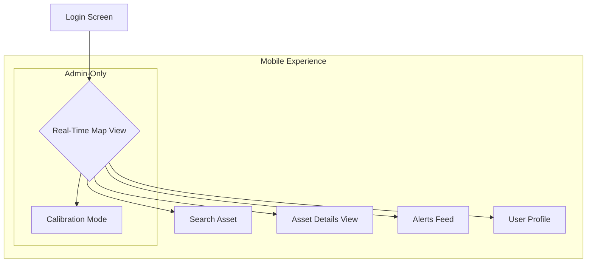

# **User-Experience (UX) Design Document: RTLS Analytics Platform**

## **1. Introduction**

### **1.1. Project Vision**

To create an intuitive, powerful, and reliable Real-Time Location System (RTLS) Analytics Platform. The system will empower Operations Managers to move beyond simple asset tracking and unlock actionable business intelligence. By providing clear visualizations of operational bottlenecks and staff behavior patterns, the platform aims to enhance efficiency, improve procedural compliance, and deliver a seamless user experience that is valued for its ease of use.

### **1.2. Target Audience**

The design accommodates two primary user personas with distinct goals and needs:

* **Carlos Mendes (The Operations Manager):** The primary consumer of data. Carlos needs to quickly understand operational patterns, identify inefficiencies, and audit behavior without a steep learning curve. His experience is centered on analytics and real-time monitoring.
* **Alex (The Setup Guru):** The technical administrator. Alex is responsible for the system's integrity and accuracy. His experience is focused on setup, configuration, and maintenance. The design must provide him with precise and reliable tools.

### **1.3. Core UX Goals**

* **Clarity Over Clutter:** Prioritize clear data visualization and an uncluttered interface. Users should understand the state of their operations at a glance.
* **Effortless Analytics:** Generating powerful reports (Trajectory, Heatmap, Dwell Time) should be an intuitive, step-by-step process that requires minimal training.
* **Trust and Reliability:** The interface must feel stable, responsive, and accurate. The user's confidence in the data is paramount.
* **Seamless Cross-Platform Experience:** Provide a consistent and intuitive experience across both the comprehensive web dashboard and the focused mobile application.
* **Accessibility First:** Ensure the design is usable by people with the widest possible range of abilities by adhering to accessibility best practices, particularly regarding color contrast and navigation.

---

## **2. Information Architecture**

### **2.1. Sitemap**

#### **2.1.1. Web Application Sitemap**

```mermaid
graph TD
    A[Login Page] --> B{Dashboard};

    subgraph Authenticated Experience
        B --> C[Real-Time Map View];
        B --> D[Analytics Hub];
        B --> E[Alerts Center];
        B --> F[Admin Panel];
        B --> G[User Profile/Settings];

        C --> C1[Asset Details Panel];
        C --> C2[Search & Filter Controls];

        D --> D1[Trajectory Analysis];
        D --> D2[Heatmap Generation];
        D --> D3[Dwell Time Reports];
        D --> D4[Zone Entry/Exit Logs];
        D --> D5[Zone Management (Create/Edit Geofences)];

        E --> E1[Configure New Alert];
        E --> E2[View Alert History];

        F --> F1[Asset Management (Add/Edit/Bulk Import)];
        F --> F2[Gateway Management (Place/Configure)];
        F --> F3[Floor Plan Management];
        F --> F4[System Settings (Data Retention)];
    end

    style F fill:#f9f,stroke:#333,stroke-width:2px
```

#### **2.1.2. Mobile Application Sitemap**



### **2.2. User Flows with Narrative**

*Diagrams for these flows will be provided as separate mermaid files for clarity.*

1. **Flow 1: Carlos Generates a Heatmap to Identify Bottlenecks.**
    * **Scenario & Mindset:** It’s Tuesday morning, and Carlos notices that the morning shift's output is down. He suspects a recurring bottleneck near the main loading bay but needs proof. He feels pressure to solve the slowdown and needs the platform to quickly validate his hunch so he can re-route traffic before the next shift.
    * **Steps:** Login → Navigate to Analytics Hub → Select Heatmap → Choose a time range (e.g., "Last 24 Hours") → Click "Generate" → View heatmap overlay on the Real-Time Map → Adjust color intensity/opacity for clarity.

2. **Flow 2: Carlos Audits Staff Behavior with Trajectory.**
    * **Scenario & Mindset:** Following a minor security incident, Carlos needs to verify that the on-duty guard completed their required patrol route. He is not trying to "catch" the employee, but rather to ensure procedural compliance and identify if the prescribed route is problematic. He needs a clear, undeniable visual record of the guard's movement.
    * **Steps:** Login → Go to Analytics Hub → Select Trajectory Analysis → Search for and select the specific asset (guard's tag) → Define the shift time range (start/end) → Click "Generate" → The map displays the asset's path as a line → Carlos can "play back" the movement over time.

3. **Flow 3: Alex Sets Up a New Wing of the Facility.**
    * **Scenario & Mindset:** The company has just opened a new wing. Alex is focused and methodical. His goal is to get the new area online flawlessly before the operations team begins using it. He values efficiency and precision; any error in setup could lead to inaccurate data, which he wants to avoid at all costs.
    * **Steps:** Login → Navigate to Admin Panel → Floor Plan Management → Upload new floor plan image → Go to Gateway Management → Drag and place new gateway icons onto the map, assigning their IDs → Go to Asset Management → Select Bulk Import → Upload CSV of new assets.

4. **Flow 4: Carlos Finds a Missing Asset Using the Mobile App.**
    * **Scenario & Mindset:** Carlos is walking the floor when he gets a radio call that a high-value mobile scanning unit is missing. Time is critical. He is away from his desk and needs to find it immediately. He pulls out his phone, feeling a sense of urgency. He needs the app to be fast, simple, and direct.
    * **Steps:** Open Mobile App & Login → Tap the search icon → Start typing the asset name ("Scanner-08") → Select the correct asset from the results → The map centers on the asset's real-time location → The user's own location is shown as a "blue dot," allowing him to navigate towards the asset.

---

## **3. Wireframes (Low-Fidelity)**

*These wireframes illustrate the layout and functional elements, not the final visual design.*

### **3.1. Web App: Main Dashboard / Real-Time Map View**

* **1. Main Navigation:** Clear icons for Map, Analytics, Alerts, and Admin.
* **2. Global Search:** Quickly find any asset from any screen.
* **3. Map View:** The central component, displaying the floor plan and asset icons.
* **4. Asset List & Filter:** A collapsible panel to see a list of all assets and filter by type (e.g., "Staff," "Equipment").
* **5. Asset Details Panel:** Appears when an asset is clicked. Shows key info and provides shortcuts to analytics (e.g., "View Trajectory").
* **6. Time Control:** A global control to view the map at a specific point in time or switch to live view.

### **3.2. Web App: Analytics Hub**

* **1. Analysis Type Selector:** Tabs to switch between Trajectory, Heatmap, Dwell Time, and Zone Reports.
* **2. Configuration Panel:** Contextual options appear here. For a heatmap, it's the time range selector. For a trajectory, it's the asset selector and time range.
* **3. Primary Action Button:** A clear "Generate Report" or "Run Analysis" button.
* **4. Data Visualization Area:** The map dynamically updates to show the requested analysis (e.g., heatmap overlay, trajectory line).
* **5. Report Export:** An option to export the report data as a CSV or PDF.

### **3.3. Mobile App: Core Interface**

* **1. Map-Centric View:** The map is the primary interface, taking up most of the screen.
* **2. Prominent Search Bar:** The main way for users to interact is by searching for an asset.
* **3. Bottom Navigation:** Simple navigation for Map, Alerts, and Profile.
* **4. Asset Details Bottom Sheet:** When an asset is tapped, a non-intrusive panel slides up from the bottom with key details and actions.

---

## **4. Visual Design & Style Guide**

### **4.1. Color Palette**

This palette is designed for clarity, professionalism, and high accessibility (WCAG AA compliant contrast ratios).

* **Primary (UI Backgrounds):**
  * Dark Mode UI: `#1A1A2E` (Very Dark Blue)
  * Light Mode UI: `#F8F9FA` (Off-White)
* **Secondary (Containers, Panels):**
  * Dark Mode: `#16213E` (Dark Slate Blue)
  * Light Mode: `#FFFFFF` (White)
* **Accent (Buttons, Links, Highlights):**
  * `#0F3460` (Strong Blue) - Provides excellent contrast on both light and dark backgrounds.
* **Text:**
  * Dark Mode: `#E9F6FF` (Light Cyan)
  * Light Mode: `#212529` (Near Black)
* **Data Visualization:**
  * **Heatmap Gradient:** `[#00FF00 (Low Intensity) -> #FFFF00 -> #FFA500 -> #FF0000 (High Intensity)]` - A standard, easily understood gradient.
  * **Trajectory Line:** `#50C878` (Emerald Green) - Stands out against the map without being aggressive.

### **4.2. Typography**

* **Font Family:** **Inter**. A clean, highly legible sans-serif font designed for user interfaces. It's available for free via Google Fonts.
* **Typographic Scale:**
  * Heading 1 (H1): 32px, Bold
  * Heading 2 (H2): 24px, Bold
  * Heading 3 (H3): 18px, Semi-Bold
  * Body Text: 16px, Regular
  * Labels / UI Text: 14px, Medium

### **4.3. UI Components**

* **Buttons:**
  * **Primary:** Solid fill with Accent color (`#0F3460`), white text, rounded corners (8px).
  * **Secondary:** Outlined with Accent color, text in Accent color, rounded corners.
  * **State:** Hover and pressed states will have a subtle brightness change to provide feedback.
* **Forms:**
  * Input fields will have a clean, simple border.
  * On focus, the border will be highlighted with the Accent color.
  * Labels will be placed above the input fields for clarity.
* **Icons:**
  * Use a consistent, clean, solid-style icon set like **Feather Icons** or **Material Symbols**. This ensures visual harmony and quick recognition of functions.

---

## **5. UI States & Interaction Design**

This section defines how the interface communicates its status to the user, ensuring a smooth and predictable experience.

### **5.1. Empty States**

Empty states are shown when there is no data to display. They are an opportunity to guide and educate the user.

* **No Assets Tracked (Admin View):**
  * **Visual:** The main map area shows the floor plan but no icons. A message box in the center of the screen displays a helpful icon (e.g., a tag), a clear heading "No Assets are Being Tracked Yet," and a call-to-action button: "Add Your First Asset."
* **Analytics Report with No Data:**
  * **Visual:** If a user runs a report for a time range with no movement data, the map area will show a message: "No data available for the selected time range. Please try a different period."
* **Alerts Center (No Alerts):**
  * **Visual:** The alerts list will display a message: "You have no active alerts. Would you like to create one?" with a "Configure New Alert" button.

### **5.2. Loading States**

Loading states provide feedback that the system is working, which is critical for user trust, especially during data-intensive tasks.

* **Generating a Report (Heatmap, Trajectory):**
  * **Interaction:** After the user clicks "Generate," the configuration panel becomes disabled to prevent further changes. The "Generate" button is replaced with a spinner and the text "Generating..."
  * **Visual:** The map area will be overlaid with a semi-transparent layer, and a loading spinner or a pulsing animation will appear in the center. This prevents interaction with stale data while the new report is being computed.
* **Initial Page Load:**
  * **Visual:** Upon first loading the dashboard, "skeleton screens" will be used. These are placeholder shapes that mimic the final layout of the interface (e.g., grey boxes for the map and side panels). This makes the application feel faster and more responsive than a blank white screen.

### **5.3. Error States**

Error states communicate that something has gone wrong in a clear, non-technical, and helpful way.

* **Form Validation Error (e.g., Adding an Asset):**
  * **Interaction:** If a user submits a form with an invalid field (e.g., a duplicate Tag ID), the form will not submit.
  * **Visual:** The specific input field causing the error will be highlighted with a red border. A small text message in red will appear directly below the field explaining the error (e.g., "This Tag ID already exists.").
* **API/Server Error (e.g., Report Fails):**
  * **Visual:** A non-intrusive "toast" notification will appear at the top of the screen. It will have a red background, an error icon, and a simple message like: "Could not generate the report. Please try again later." It should not contain technical jargon like "Error 500." The notification should be dismissible.

---

### **CHANGE LOG 📝**

* **Rev. 2:** Added "Scenario & Mindset" narratives to all user flows in section 2.2 to improve clarity and provide context.
* **Rev. 2:** Added a new major section, "5. UI States & Interaction Design," to improve comprehensiveness. This section defines designs for Empty States, Loading States, and Error States.
