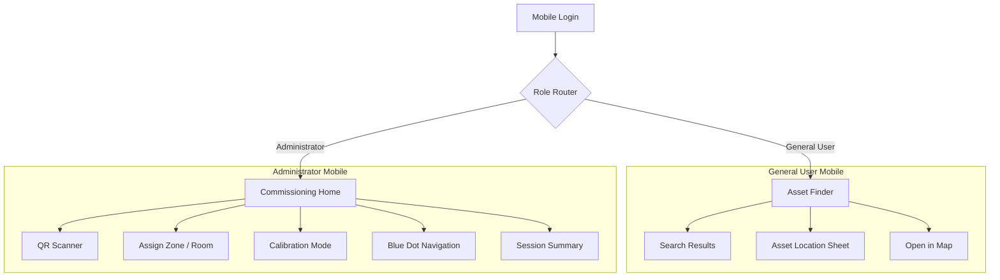

# **UX Design & User Stories: RTLS Analytics Platform**

## **1. Introduction**

### **1.1. Project Vision**

To create an intuitive, powerful, and reliable Real-Time Location System (RTLS) Analytics Platform for **restaurants and large catering operations**. The system empowers Operations Managers to move beyond simple asset tracking, unlocking actionable intelligence on service SLAs, staff round-trips, and kitchen bottlenecks.

### **1.2. Core UX Goals**

* **Clarity & Confidence:** Display clear data visualization including "Confidence Scores" so users know when tracking is pinpoint accurate versus zone-level.
* **Effortless Analytics:** Generating reports (Heatmaps, Round-Trip Times, Table SLAs) must be an intuitive, step-by-step process.
* **Seamless Cross-Platform:** Consistent experience across the web dashboard and the mobile commissioning/navigation app.

---

## **2. Personas**

There are two primary personas guiding the design and functionality of the project.

### **2.1. The Administrator**

| **Name** | **Alex (The Setup Guru)** |
| :--- | :--- |
| **Role** | IT / Systems Administrator |
| **Personality** | Meticulous, detail-oriented, and pragmatic. Alex values precision and reliability above all else. |
| **Core Goal** | To ensure the RTLS platform is a trustworthy source of truth for restaurant and catering operations. The data must be accurate, the hardware must be reliable, and the system must be stable. |
| **Motivations** | - Setting up a system that "just works" without constant firefighting.<br>- Empowering operational teams with data they can trust.<br>- Preventing "garbage in, garbage out" by ensuring precise calibration. |
| **Frustrations** | - Vague setup instructions.<br>- Systems that require constant manual adjustments.<br>- Inaccurate data that undermines user confidence. |
| **Quote** | *"If the data isn't accurate, the entire system is useless. My job is to make sure we can trust every single data point."* |

### **2.2. The General User**

| **Name** | **Carlos Mendes (The Operations Manager)** |
| :--- | :--- |
| **Role** | Operations Manager (e.g., Restaurant General Manager, Catering Operations Director) |
| **Personality** | Strategic, results-driven, and busy. Carlos needs to see the big picture quickly but also needs the ability to investigate anomalies. |
| **Core Goal** | To use location data to make smarter operational decisions that improve efficiency, enhance customer experience, and reduce costs. |
| **Motivations** | - Quickly understanding staff and asset movement patterns.<br>- Tracking service SLAs, table round trips, and kitchen bottlenecks.<br>- Proactively addressing issues before they become major problems. |
| **Frustrations** | - Drowning in raw data without clear insights.<br>- Spending too much time searching for assets or people.<br>- Not having concrete evidence to back up operational changes. |
| **Quote** | *"Don't just show me dots on a map. Show me what it means. How can I use this information to run my business better today?"* |

---

## **3. User Story Map & Flows**

This section organizes our features into a narrative flow, combining the user stories with real-world scenarios.

### **3.1. Activity 1: System Setup & Configuration (Alex)**

*As Alex, I need to set up the physical and digital environment flawlessly to ensure data accuracy.*

**Narrative Flow:**
* **Scenario:** An extension to the dining hall has been built. Alex needs to bring new BLE gateways online and establish the baseline.
* **Steps:** App Commissioning Mode → Scans Gateway QR → Selects "Dining Extension" zone → Mounts gateway → Taps "Start Data Collection" → Walks through the new dining room for 15 minutes → App generates the radiomap offsets automatically.

**Acceptance Criteria:**
| ID | User Story | Confirmation | Priority |
| :--- | :--- | :--- | :--- |
| **US-ADM-01** | As **Alex**, I want to upload a floor plan image, so that I have a visual canvas for my gateway and asset layout. | User can select image; displayed as background; scale is set via reference points. | **Must-have** |
| **US-ADM-02** | As **Alex**, I want to place and label gateway icons (Economic/Premium tier) on the map. | Drag/drop gateways; enter name/ID and tier. | **Must-have** |
| **US-ADM-03** | As **Alex**, I want to use the mobile app to scan device QR codes and choose their zone, so I can seamlessly commission the infrastructure. | Scanner input resolves the device, prompts for zone/room, and shows floor-linked commissioning context. | **Must-have** |
| **US-ADM-04** | As **Alex**, I want to run an automated calibration assistant that collects data to calculate offsets and build the initial radiomap. | Calibration runs in background; collects RSSI; confirms map generation. | **Must-have** |
| **US-ADM-05** | As **Alex**, I want to bulk-import a list of asset tags from a CSV file. | Sample CSV available; successful batch import including tag profiles (update rate). | **Must-have** |

### **3.2. Activity 2: Daily Operations Monitoring (Carlos)**

*As Carlos, I need a high-level overview to quickly assess the current state of my operations.*

**Narrative Flow:**
* **Scenario:** A VIP table has been unvisited by waitstaff for over 15 minutes, violating the SLA.
* **Steps:** Alert pops up in Dashboard → Carlos clicks alert → Map centers on the specific table → Shows no staff assets nearby.

**Acceptance Criteria:**
| ID | User Story | Confirmation | Priority |
| :--- | :--- | :--- | :--- |
| **US-GEN-01** | As **Carlos**, I want to see a high-level dashboard with key metrics (e.g., active assets, Table Service SLAs) upon login. | Displays "Active Assets", "Active Alerts", and "SLA Metrics"; auto-refreshes. | **Must-have** |
| **US-GEN-02** | As **Carlos**, I want to see moving assets in real-time on a map with confidence scores. | Icons update live (0.5-20Hz); low confidence estimates fall back to Zone highlighting. | **Must-have** |
| **US-GEN-03** | As **Carlos**, I want to filter the map view by asset type (e.g., "waiter," "cooking equipment") to reduce clutter. | Filter toggles asset categories on/off perfectly. | **Should-have** |
| **US-GEN-04** | As **Carlos**, I want to receive an alert when a high-value asset or staff member exceeds a time limit in a specific zone (e.g., table SLA violation). | Alerts trigger on dwell-time thresholds; in-app and optional email notification. | **Must-have** |

### **3.3. Activity 3: Deep-Dive Analysis (Carlos)**

*As Carlos, I need to investigate patterns and specific incidents to find opportunities for improvement.*

**Narrative Flow:**
* **Scenario:** Service times have spiked. Carlos wants to see if the delay is in food prep or in servers picking up plates.
* **Steps:** Analytics Hub → Heatmap (Last 4 Hours) → Sees high density at the "Pass-through Kitchen" zone → Runs a Round-Trip report for Waitstaff → Confirms the trip time is excessive.

**Acceptance Criteria:**
| ID | User Story | Confirmation | Priority |
| :--- | :--- | :--- | :--- |
| **US-ANL-01** | As **Carlos**, I want to view the historical trajectory of staff or a cart on the map, so I can understand their exact path and round-trips. | Trajectory drawn over set time; fast loading via TimescaleDB aggregates. | **Must-have** |
| **US-ANL-02** | As **Carlos**, I want to define specific points of interest (POIs) such as "Pass-through Kitchen" or "Loading Dock". | Draw POI polygons on map and name them. | **Must-have** |
| **US-ANL-03** | As **Carlos**, I want to generate a report showing round-trip times between the kitchen and dining area, to measure staff efficiency. | Select asset/zones; calculates average transition times and total trips. | **Must-have** |
| **US-ANL-04** | As **Carlos**, I want to see a heatmap of the floor, so I can identify kitchen bottlenecks and high-traffic dining paths. | Colored overlay for traffic density; toggle visibility. | **Should-have** |

### **3.4. Activity 4: On-the-Go Location & Navigation (Mobile App)**

*As a user on the floor, I need to find assets quickly and calibrate the system effectively.*

**Acceptance Criteria:**
| ID | User Story | Confirmation | Priority |
| :--- | :--- | :--- | :--- |
| **US-MOB-01** | As **Carlos**, I want to search for an asset on my mobile app and see its location to find it quickly (e.g., missing POS terminal). | Search returns matching assets, preserves recent searches, shows a location sheet, and offers open-in-map handoff into Live Map. | **Must-have** |
| **US-MOB-02** | As **Alex**, I want to see my own location as a "blue dot" while in calibration mode, so I can accurately map signal strengths. | Calibration mode updates a visible blue-dot capture as the user records floor checkpoints and reviews a session summary. | **Must-have** |

---

## **4. Information Architecture**

### **4.1. Experience Model**

The platform uses a **role-aware command-center architecture** so that each persona lands in the part of the product that matches their primary intent.

| Role | Default Landing | Primary Jobs | Persistent Navigation |
| :--- | :--- | :--- | :--- |
| **Administrator (Alex)** | **Setup & Health Overview** | Configure floor plans, gateways, tags, calibration, tiers, and system reliability. | Overview, Live Map, Zones, Alerts, Admin, Health, Audit Log |
| **General User (Carlos)** | **Operations Overview** | Monitor live operations, react to alerts, and run analytical investigations. | Overview, Live Map, Analytics, Alerts, Reports |

Global shell elements remain consistent across web screens:

* **Top bar:** Site/floor selector, time context, live connection status, alert tray, profile menu.
* **Left rail:** Primary navigation by workflow, not by database object.
* **Context pane/drawer:** Secondary details without forcing route changes.
* **Map-first content model:** Map, zones, assets, alerts, and reports cross-link to the same location context.

### **4.2. Web Application Sitemap**

```mermaid
graph TD
    A[Login] --> B{Role Router}
    B -->|Administrator| C[Setup & Health Overview]
    B -->|General User| D[Operations Overview]

    subgraph Shared Web Experience
        C --> E[Live Map Workspace]
        D --> E
        D --> F[Analytics Workspace]
        D --> G[Alerts Center]
        C --> G
    end

    subgraph Live Map Workspace
        E --> E1[Asset Search & Filters]
        E --> E2[Asset Details Drawer]
        E --> E3[Zone & Table Detail Drawer]
        E --> E4[Confidence Layer Controls]
        E --> E5[Trajectory Replay Overlay]
    end

    subgraph Analytics Workspace
        F --> F1[Heatmap Analysis]
        F --> F2[Trajectory Analysis]
        F --> F3[Round-Trip Report]
        F --> F4[Dwell Time Report]
        F --> F5[Table SLA Trends]
    end

    subgraph Alerts Center
        G --> G1[SLA Violations]
        G --> G2[Unauthorized Geofence Alerts]
        G --> G3[Maintenance Alerts]
        G --> G4[Notification Rules]
        G --> G5[Alert History]
    end

    subgraph Administrator Console
        C --> H[Admin Console]
        H --> H1[Floor Plans & Scale]
        H --> H2[Gateway Placement & Tier Profiles]
        H --> H3[Asset Registry & CSV Import]
        H --> H4[Calibration Wizard]
        H --> H5[Zone & POI Manager]
        H --> H6[User Access & Roles]
        H --> H7[Infrastructure Health]
        H --> H8[Audit Log]
    end
```



### **4.3. Mobile Application Sitemap**



### **4.4. Core Content Relationships**

| Object | Created In | Consumed In | Why It Matters |
| :--- | :--- | :--- | :--- |
| **Floor / Site** | Floor Plans & Scale | Live Map, Analytics, Mobile | Every task is spatial and starts with the correct floor context. |
| **Zones / POIs / Tables** | Zone & POI Manager | Alerts, SLA rules, Dwell, Round-Trip, Heatmaps | Zones convert raw positions into operational meaning. |
| **Gateways / Tier Profiles** | Gateway Placement & Tier Profiles | Health, Calibration, Live Confidence | Hardware quality directly affects confidence and alert trustworthiness. |
| **Assets / Tags** | Asset Registry, QR Scanner, CSV Import | Live Map, Search, Alerts, Reports | Primary tracked entities for both monitoring and analysis. |
| **Alerts** | Rules Engine / Health Monitoring | Overview, Alerts Center, Mobile handoff | Drives immediate user action and exception handling. |
| **Reports** | Analytics Workspace | Operations review and optimization meetings | Transforms movement data into staffing and service decisions. |
| **Audit Events** | Any admin change | Audit Log | Supports governance, traceability, and change accountability. |

### **4.5. User Task Flows**

| User Task | Stories / Requirements | Entry Point | Ideal Flow | Completion Signal |
| :--- | :--- | :--- | :--- | :--- |
| **Sign in and route by role** | FR-SEC-001, FR-SEC-002 | Login | Enter credentials -> system validates role -> routes to role-specific home | Correct landing page plus visible role badge |
| **Upload and scale floor plan** | US-ADM-01, FR-ADM-001 | Admin Console -> Floor Plans & Scale | Upload image -> place two reference points -> enter real distance -> save floor | Floor appears in map selector with scale confirmed |
| **Place gateways and assign tier** | US-ADM-02, FR-ADM-002, FR-ADM-004 | Admin Console -> Gateway Placement | Select floor -> drag gateway onto map -> label gateway -> choose Economic or Premium tier -> complete Premium modality and calibration metadata when needed -> save | Gateway marker persists with tier color and status |
| **Commission infrastructure via QR** | US-ADM-03, NFR-USA-002 | Mobile -> Commissioning | Scan or enter QR payload -> identify device -> select floor -> assign zone/room -> confirm device context | Device identity, floor, and zone are visible in the mobile commissioning session |
| **Run automated calibration** | US-ADM-04, FR-ADM-003, US-MOB-02 | Mobile -> Commissioning | Choose floor and target -> start session -> walk route with blue dot guidance -> tap checkpoints -> review summary | Session summary shows elapsed time, samples, and completed checkpoints for later calibration follow-up |
| **Bulk import asset tags** | US-ADM-05, FR-ADM-005 | Admin Console -> Asset Registry | Download template -> upload CSV -> review validation -> fix errors inline -> confirm import | Imported assets visible with profile, update rate, and battery policy |
| **See operations overview on login** | US-GEN-01 | Operations Overview | Review KPI cards, live alerts, SLA snapshot, and map preview | User can decide whether to drill into map, alerts, or analytics in one click |
| **Monitor assets in real time** | US-GEN-02, FR-VIS-001, FR-VIS-002, FR-VIS-003 | Live Map Workspace | Choose floor -> watch live movement -> inspect confidence state -> open asset drawer | Map shows current position or zone fallback with last update time |
| **Filter and search assets** | US-GEN-03, FR-VIS-004, US-MOB-01 | Live Map or Mobile Asset Finder | Search by name/tag/type -> apply category filters -> focus one asset or cohort | Map centers on result and clutter is reduced |
| **Respond to SLA or geofence alerts** | US-GEN-04, FR-NOT-001, FR-NOT-002, FR-NOT-003, FR-ANL-006 | Alert tray or Alerts Center | Open alert -> map recenters on affected table/zone/asset -> inspect context -> acknowledge/escalate | Alert status changes and audit trail records action |
| **Define zones and POIs** | US-ANL-02, FR-ANL-001, NFR-USA-001 | Admin Console -> Zone & POI Manager | Draw polygon -> name area -> assign type (table, kitchen, dock, restricted zone) -> save | New zone becomes selectable in rules and reports |
| **Replay historical trajectory** | US-ANL-01, FR-ANL-005 | Analytics -> Trajectory | Select asset and time range -> render path -> scrub timeline -> inspect dwell moments | Path playback and event markers appear on map |
| **Generate heatmap** | US-ANL-04, FR-ANL-002 | Analytics -> Heatmap | Select floor, asset set, and time range -> generate density layer -> compare hotspots | Heatmap overlay renders with legend and export option |
| **Measure round-trip efficiency** | US-ANL-03, FR-ANL-003 | Analytics -> Round-Trip | Select origin zone, destination zone, and cohort -> run report -> inspect averages and outliers | Summary metrics, table, and trend chart are available |
| **Measure dwell time** | FR-ANL-004 | Analytics -> Dwell Time | Select zone, asset type, and time range -> run report -> compare by shift or cohort | Dwell distribution and threshold breaches are visible |
| **Monitor infrastructure health** | NFR-REL-001 | Setup & Health Overview | Review gateway status, heartbeat, battery, packet loss -> drill into failing device | Device marked healthy, degraded, or offline with next action suggested |
| **Review configuration history** | FR-SEC-003 | Admin Console -> Audit Log | Filter by user, object, date, action type -> inspect change details | Traceable record of who changed what and when |

---

## **5. Wireframes (Low-Fidelity)**

### **5.1. Web App: Login & Role Routing**

**Supports:** FR-SEC-001, FR-SEC-002

```text
+--------------------------------------------------------------+
| RTLS Analytics Platform                                      |
| High-trust sign-in for operations and system administration  |
|--------------------------------------------------------------|
| Email ____________________                                   |
| Password _________________        [ Sign In ]                |
|                                                              |
| Security notice | System status | Last successful sync       |
+--------------------------------------------------------------+
```

* On successful login, users are routed by role rather than forced into a generic home.
* The first post-login screen includes a compact orientation panel: current site, live system state, unresolved alerts.

### **5.2. Web App: Operations Overview**

**Supports:** US-GEN-01, FR-NOT-001, FR-NOT-002, NFR-REL-001

Implementation baseline note:

* The delivered baseline uses only currently implemented live-location and gateway-health signals.
* KPI and queue content in the current product build therefore focuses on active assets, confidence degradation, restricted-zone presence, and stale gateways.
* Dedicated alert workflows, SLA risk cards, and trend rows remain planned follow-on work after the alerting and analytics changes land.

```text
+--------------------------------------------------------------------------------+
| Top Bar: Site/Floor | Time | Live Status | Alert Tray | User                  |
|--------------------------------------------------------------------------------|
| KPI Strip: Active Assets | SLA At Risk | Critical Alerts | Gateways Offline    |
|--------------------------------------------------------------------------------|
| Live Map Preview                      | Priority Queue                         |
| - floor snapshot                      | - SLA violation cards                  |
| - top moving assets                   | - unauthorized zone events             |
| - active zones                        | - maintenance warnings                 |
|--------------------------------------------------------------------------------|
| Trend Row: SLA by hour | kitchen dwell trend | round-trip trend               |
+--------------------------------------------------------------------------------+
```

* Designed for first-glance triage in under 10 seconds.
* Every card has a direct action: `View on map`, `Open report`, or `Acknowledge`.

### **5.2.A. Web App: Admin Health and Audit Baseline**

**Supports:** NFR-REL-001, NFR-REL-002, FR-SEC-003

Implementation baseline note:

* The delivered administrator shell now exposes three route-aware views: Spatial, Health, and Audit.
* Health summarizes gateway heartbeat risk, battery risk, telemetry totals, alert pressure, audit totals, and the local observability contract (`/health`, `/metrics`, and `X-Request-ID`).
* Audit uses server-side filtering for recent persisted events by actor email, category, action type, and target type.
* Rich diff rendering, date-range controls, packet-loss analysis, and external dashboards remain follow-on work.

```text
+--------------------------------------------------------------------------------+
| Admin Rail: Spatial | Health | Audit                                          |
|--------------------------------------------------------------------------------|
| Health Summary: Gateways | Gateway Risks | Telemetry | Audit + Alerts          |
|--------------------------------------------------------------------------------|
| Gateway Risks Panel                   | Observability Baseline                 |
| - stale / missing heartbeat cards     | - /health                              |
| - low battery cards                   | - /metrics                             |
| - floor and gateway identifiers       | - X-Request-ID                         |
|--------------------------------------------------------------------------------|
| Audit Filters: Actor | Category | Action Type | Target Type | Apply / Clear    |
|--------------------------------------------------------------------------------|
| Newest-first bounded audit rows with persisted detail payload                  |
+--------------------------------------------------------------------------------+
```

### **5.3. Web App: Live Operations Map**

**Supports:** US-GEN-02, US-GEN-03, US-GEN-04, FR-VIS-001, FR-VIS-002, FR-VIS-003, FR-VIS-004, US-MOB-01

Implementation baseline note:

* The delivered Live Map supports floor selection, live markers, confidence-aware visualization, search, category/confidence/location-type filters, and a selected-asset drawer.
* Zone fallback and confidence states are implemented now because they are already backed by the current positioning contract.
* Canonical live-location results now carry source-tier, source-modality, and optional precision metadata, so Premium AoA or UWB updates can reuse the same Live Map and drawer patterns without implying that every point estimate came from the Economic BLE path.
* Alert-specific overlays, trajectory replay, and analytics drill-ins remain future work.

```text
+------------------------------------------------------------------------------------------------+
| Search __________________  Filters: Staff Equipment Tags  Floor  Confidence  Time Context      |
|------------------------------------------------------------------------------------------------|
| Filter Rail               | Map Canvas                                                          |
| - Asset types             | - Floor plan                                                        |
| - Zones                   | - Live asset markers                                                 |
| - Confidence threshold    | - Zone halos / restricted zones                                      |
| - Alert state             | - Table SLA highlights                                               |
|------------------------------------------------------------------------------------------------|
| Event Timeline            | Details Drawer                                                      |
| - recent updates          | - asset name / last seen / confidence / dwell / actions             |
| - alert markers           | - jump to trajectory / alert history / related zone                 |
+------------------------------------------------------------------------------------------------+
```

* Clicking an alert or search result recenters the map and opens the contextual drawer without a full page change.
* Confidence fallback behavior is explicit: precise point -> radius ring -> zone wash.

### **5.4. Web App: Alerts Center & Rule Builder**

**Supports:** US-GEN-04, FR-NOT-001, FR-NOT-002, FR-NOT-003, FR-ANL-006

```text
+-----------------------------------------------------------------------------------+
| Alert Tabs: SLA | Unauthorized Geofence | Maintenance | History                   |
|-----------------------------------------------------------------------------------|
| Alert List                               | Rule / Detail Panel                    |
| - severity badge                         | - trigger condition                    |
| - affected asset/zone/table              | - threshold or geofence                |
| - age / owner / channel                  | - email + in-app delivery              |
| - acknowledge / escalate                 | - action log / note / assignment       |
+-----------------------------------------------------------------------------------+
```

* Rule creation uses plain-language builders such as "If no waiter enters Table 12 zone for 15 min".
* History keeps alert state changes visible for later review and operational learning.

### **5.5. Web App: Analytics Workspace**

**Supports:** US-ANL-01, US-ANL-03, US-ANL-04, FR-ANL-002, FR-ANL-003, FR-ANL-004, FR-ANL-005

Implementation baseline note:

* The delivered Analytics workspace now supports trajectory replay, heatmap generation, dwell reporting, round-trip reporting, and table SLA trend views inside the shared monitoring shell.
* The first delivery keeps analytics interactive and read-only: bounded time windows, report switching, and explicit empty-state handling are included now.
* Export jobs, saved presets, compare-period workflows, and scheduled report delivery remain later work.

```text
+------------------------------------------------------------------------------------------------+
| Report Switcher: Heatmap | Trajectory | Round-Trip | Dwell Time | SLA Trends                   |
|------------------------------------------------------------------------------------------------|
| Parameter Rail                         | Analysis Canvas                                             |
| - floor / zone / cohort                | - heatmap or route map                                      |
| - time range                           | - chart / legend / report table                             |
| - compare by shift / daypart           | - annotation layer                                          |
|------------------------------------------------------------------------------------------------|
| Insight Footer: export | save preset | compare with previous period | share link                |
+------------------------------------------------------------------------------------------------+
```

* The workspace uses one mental model for all delivered analytics: choose scope, choose time, generate, inspect.
* Deeper export, preset, and cross-period comparison workflows remain deferred even though the IA already reserves room for them.

### **5.6. Web App: Zone & POI Editor**

**Supports:** US-ANL-02, FR-ANL-001, NFR-USA-001, FR-NOT-002

```text
+-----------------------------------------------------------------------------------+
| Tools: Select | Polygon | Vertex Edit | Duplicate | Delete                        |
|-----------------------------------------------------------------------------------|
| Map Canvas                                 | Properties Panel                     |
| - floor plan                               | - name                               |
| - existing zones                           | - type: table / kitchen / restricted |
| - draft polygon                            | - SLA eligibility                    |
|                                            | - alert participation                |
+-----------------------------------------------------------------------------------+
```

* The editor keeps drawing on the left and rule meaning on the right, so users do not lose spatial context while configuring alerts.

### **5.7. Web App: Admin Setup Console**

**Supports:** US-ADM-01, US-ADM-02, US-ADM-05, FR-ADM-001, FR-ADM-002, FR-ADM-004, FR-ADM-005

```text
+------------------------------------------------------------------------------------------------+
| Admin Tabs: Floor Plans | Gateways | Assets | Tier Profiles                                     |
|------------------------------------------------------------------------------------------------|
| Left: object list / CSV import / templates                                                     |
| Right: map or form canvas                                                                      |
| - upload floor plan                                                                            |
| - place gateway markers                                                                        |
| - bulk-import tags                                                                             |
| - edit update rate / battery profile / tier                                                   |
+------------------------------------------------------------------------------------------------+
```

* One workspace supports both spatial setup and structured asset configuration.
* Validation is inline, especially for CSV import mismatches and duplicate tag IDs.

### **5.8. Web App: Calibration Wizard**

**Supports:** US-ADM-04, FR-ADM-003

```text
+-----------------------------------------------------------------------------------+
| Stepper: Scope -> Device Check -> Walk Path -> Processing -> Results              |
|-----------------------------------------------------------------------------------|
| Main Panel                               | Right Panel                            |
| - instructions by step                   | - gateway checklist                    |
| - floor preview                          | - RSSI quality feed                    |
| - collection progress                    | - elapsed time                         |
| - completion quality score               | - retry / finish actions               |
+-----------------------------------------------------------------------------------+
```

* The wizard emphasizes trust: what is being collected, how long remains, and whether data quality is sufficient.

### **5.9. Web App: Infrastructure Health & Audit Log**

**Supports:** NFR-REL-001, FR-SEC-003

```text
+------------------------------------------------------------------------------------------------+
| Health Cards: Online Gateways | Battery Warnings | Packet Loss | Delayed Heartbeats            |
|------------------------------------------------------------------------------------------------|
| Device Table                               | Audit Log Table                                             |
| - device status                            | - timestamp                                                  |
| - tier / floor / uptime                    | - actor                                                      |
| - battery / signal / packet loss           | - changed object                                             |
| - open detail                              | - before/after summary                                       |
+------------------------------------------------------------------------------------------------+
```

* Operations reliability and governance are adjacent because the same users often diagnose both physical and configuration issues in the same session.

### **5.10. Mobile App: Asset Finder**

**Supports:** US-MOB-01, FR-VIS-004

```text
+--------------------------------------------------------------+
| Session Panel                                                |
| - API base URL                                               |
| - web base URL                                               |
| - pasted access token                                        |
|--------------------------------------------------------------|
| Search asset _______________________                         |
|--------------------------------------------------------------|
| Result List / Recent Searches                                |
| - POS Terminal 07  | Kitchen Pass | Last seen 12s ago        |
| - Cart 03          | Dining South | Last seen 1m ago         |
|--------------------------------------------------------------|
| Location Sheet                                               |
| - selected asset details                                     |
| - confidence or precision badge                              |
| - open full location in delivered Live Map                   |
+--------------------------------------------------------------+
```

* The delivered baseline favors speed: search, identify, orient, move.
* Dedicated mobile sign-in still remains deferred, so the current screen keeps an explicit session panel for API and web endpoints plus a pasted access token.

### **5.11. Mobile App: Commissioning & Calibration**

**Supports:** US-ADM-03, US-MOB-02, NFR-USA-002

```text
+--------------------------------------------------------------+
| Scanner Input / Calibration Session                         |
|--------------------------------------------------------------|
| Floor Map Preview                                            |
| - gateways                                                    |
| - route checkpoints                                           |
| - blue dot capture                                            |
|--------------------------------------------------------------|
| Bottom Sheet                                                 |
| - detected device                                             |
| - zone selector                                               |
| - start / finish collection                                   |
| - progress and session summary                                |
+--------------------------------------------------------------+
```

* The delivered baseline accepts connected-scanner or pasted QR payloads, then keeps the floor map and blue-dot capture in one-thumb reach.

---

## **6. Visual Design & Interaction States**

### **6.1. Suggested Theme**

**Theme Name:** **Industrial Command Deck**

**Design stance:** A restrained, high-technology operations console that feels precise and mission-critical without drifting into unreadable sci-fi HUD styling.

**Why this direction fits:**

* The product is spatial, real-time, and data-dense, so the interface should feel like a live control surface.
* Administrators need trust and precision more than decorative flourish.
* Operations managers need strong contrast between normal flow, risk, and incident states.

**Differentiation anchor:** If a screenshot is shared without branding, it should still read as a **location intelligence command surface** because of the layered floor-plan map, telemetry accents, and crisp confidence/alert treatment.

### **6.2. Color System & Typography**

| Token Group | Use | Value |
| :--- | :--- | :--- |
| **Background / Base** | App chrome | `#060B14` |
| **Background / Surface** | Cards, side rails, drawers | `#0F1724` |
| **Background / Elevated** | Active panels, modals | `#152235` |
| **Stroke / Subtle** | Dividers, grids, inactive map outlines | `#24364D` |
| **Text / Primary** | Primary labels and body copy | `#EAF2FF` |
| **Text / Secondary** | Supporting labels and metadata | `#9FB1C8` |
| **Accent / Telemetry** | Live states, focused actions, precise locations | `#21D4FD` |
| **Accent / Depth** | Secondary emphasis, selected tabs, charts | `#2F6BFF` |
| **Success** | Healthy devices, completed calibration | `#22C55E` |
| **Warning** | SLA risk, low confidence caution, battery drop | `#F59E0B` |
| **Critical** | Violations, unauthorized geofence, offline status | `#F04438` |
| **Info Wash** | Large translucent map overlays | `rgba(33, 212, 253, 0.14)` |

**Typography system:**

* **Headings:** `Space Grotesk` for a technical, modern voice with enough personality for a premium product.
* **Body/UI text:** `Inter` for compact readability in dense dashboard layouts.
* **Optional utility text:** Monospaced numerals for coordinates, IDs, and timestamps only.

### **6.3. Visual Language**

* **Surfaces:** Dark layered panels with restrained translucency, subtle inner strokes, and soft edge glows near active data regions.
* **Maps:** Floor plans remain neutral; system states provide color. This prevents the background from competing with operational signals.
* **Shapes:** Rounded-rect panels with sharp internal dividers, balancing enterprise seriousness with modern polish.
* **Iconography:** Thin-to-medium stroke technical icons, always from one set, with color used only for state and priority.

### **6.4. Core Interaction States**

| Element | Normal | Hover / Focus | Active / Selected | Warning / Error |
| :--- | :--- | :--- | :--- | :--- |
| **Asset marker** | Small filled dot in telemetry blue | Marker grows by 2px and reveals quick label | Drawer opens, marker ring pulses once | Falls back to ring or zone wash if confidence degrades |
| **Confidence state** | Precise point with timestamp | Tooltip explains confidence | Medium confidence shows radius ring | Low confidence switches to translucent zone halo plus caution label |
| **Zone / Table** | Thin outline | Outline brightens and label appears | Fill tint appears with details drawer | SLA-at-risk shifts to amber; violated shifts to red |
| **Alert row** | Compact card with severity stripe | Row lift and clearer timestamp | Expanded detail panel and action buttons | Critical rows keep persistent red edge until acknowledged |
| **Gateway / device health** | Green health dot | Tooltip with last heartbeat | Selected device shows metrics drawer | Amber for battery drop, red for offline or packet loss spike |
| **Calibration session** | Ready state with checklist | Step highlight on hover | Active collection shows progress, path trace, and elapsed timer | Failed step shows cause, retry action, and blocked completion |
| **Form fields** | Low-contrast stroke | Cyan focus ring and helper text | Sticky validation summary for multi-step forms | Inline error with icon, copy, and `role=alert` behavior |

### **6.5. Motion & Feedback**

* Motion should be sparse and purposeful, mostly in the **180-240ms** range.
* Key animations: alert pulse on first arrival, one-time map recenter glide, calibration progress sweep, and heatmap fade-in.
* No continuous ornamental animation on charts or maps.
* Respect `prefers-reduced-motion` by switching pulses and glides to instant state changes.

### **6.6. Empty, Loading, and Recovery States**

| Scenario | UX Treatment |
| :--- | :--- |
| **No assets tracked yet** | Empty map with onboarding callout: "No live assets on this floor yet." Primary action: `Commission first tag`. |
| **No alerts at this moment** | Quiet-state panel with resolved status copy and optional link to alert history. |
| **No data for selected report range** | Preserve filters, show explanation, and suggest adjacent time ranges or broader cohorts. |
| **Generating radiomap / analytics** | Replace blank waits with progress states: current step, elapsed time, expected remaining time, and data-quality indicator. |
| **Gateway offline** | Show affected floor, last heartbeat, likely impact on confidence, and direct action to open Health details. |
| **CSV import validation error** | Inline row-level errors plus downloadable error report; never fail silently. |

### **6.7. Accessibility & Trust Signals**

* Maintain minimum **WCAG AA** contrast for dashboard text and map labels.
* Never rely on color alone; every alert, confidence state, and health state also has iconography or text.
* All actionable alerts and form validation errors should be announced to assistive technology.
* Timestamp and freshness indicators are always visible on live data so users can distinguish stale data from healthy silence.

---

## **7. Figma Handoff: Screen List & Component Inventory**

### **7.1. Recommended Figma File Structure**

Use one shared Figma file with the following top-level pages:

1. `00 Cover & Notes`
2. `01 Foundations`
3. `02 Components`
4. `03 Web App`
5. `04 Mobile App`
6. `05 Prototype Flows`
7. `06 Dev Handoff`

### **7.2. Foundations Page**

Create these sections inside `01 Foundations`:

| Section | Content |
| :--- | :--- |
| **Design Tokens** | Color variables, typography styles, spacing scale, elevation, border radii, motion durations |
| **Grid Systems** | Web desktop grid, web tablet grid, mobile grid, drawer widths, map safe areas |
| **Iconography** | Single icon set, status icons, map symbols, health/alert glyphs |
| **Data Visualization** | Heatmap legend, trajectory line styles, SLA trend colors, confidence states |
| **Content Rules** | Naming, label casing, timestamp format, alert copy tone, empty-state style |

### **7.3. Web Screen List**

Build the `03 Web App` page using one section per workflow.

| Frame ID | Screen Name | Purpose | Key States |
| :--- | :--- | :--- | :--- |
| **WEB-01** | Login | Secure entry and role routing | Default, focus, invalid credentials, loading |
| **WEB-02** | Operations Overview | First-glance KPI and incident triage | Normal, no active alerts, degraded live feed |
| **WEB-03** | Live Map Default | Core monitoring workspace | Normal live, low confidence mix, empty floor |
| **WEB-04** | Live Map with Asset Drawer | Asset inspection and action shortcuts | Selected asset, stale data, offline asset |
| **WEB-05** | Live Map with Zone/Table Drawer | SLA and zone-level investigation | SLA risk, SLA violation, restricted zone |
| **WEB-06** | Live Map Search Results | Find asset quickly | Results found, no result, recent searches |
| **WEB-07** | Live Map Filtered View | Reduce clutter by cohort | Staff-only, equipment-only, alert-only |
| **WEB-08** | Alerts Center List | Alert triage queue | All alerts, filtered by severity, empty state |
| **WEB-09** | Alert Detail + Rule Builder | Review and configure alert logic | View mode, edit mode, validation error |
| **WEB-10** | Analytics Heatmap | Density and bottleneck analysis | Generated, loading, no data |
| **WEB-11** | Analytics Trajectory | Historical route replay | Static path, scrubbed playback, event markers |
| **WEB-12** | Analytics Round-Trip | Measure travel efficiency | Summary view, outlier view, compare periods |
| **WEB-13** | Analytics Dwell Time | Zone time analysis | By cohort, by shift, threshold breach |
| **WEB-14** | Analytics SLA Trends | Table service performance | Stable trend, degradation, critical period |
| **WEB-15** | Zone & POI Editor | Define business-meaningful areas | Draw mode, edit mode, invalid polygon |
| **WEB-16** | Floor Plan & Scale Setup | Upload and scale new floor | Empty, uploading, scale confirmed |
| **WEB-17** | Gateway Placement | Position and label gateways | Draft gateway, placed gateway, selected gateway |
| **WEB-18** | Asset Registry | View and manage tracked assets | Populated, empty, filtered |
| **WEB-19** | CSV Import Review | Bulk import validation and correction | Clean import, row errors, success summary |
| **WEB-20** | Tier Profiles | Manage Economic vs Premium profiles | Default, edited, unsaved changes |
| **WEB-21** | Calibration Wizard | Guided setup for radiomap generation | Step 1-5, collecting, processing, failed |
| **WEB-22** | Infrastructure Health | Gateway and battery health monitoring | Healthy, warning, critical/offline |
| **WEB-23** | Audit Log | Track configuration changes | Default, filtered, empty result |

### **7.4. Mobile Screen List**

Build the `04 Mobile App` page using separate sections for general-user and admin flows.

| Frame ID | Screen Name | Purpose | Key States |
| :--- | :--- | :--- | :--- |
| **MOB-01** | Mobile Login | Authenticate and route by role | Default, biometric optional, invalid |
| **MOB-02** | Asset Finder Home | Quick asset search entry point | Empty recent list, active search |
| **MOB-03** | Asset Search Results | Fast shortlist of candidate assets | Results, no result, low-confidence result |
| **MOB-04** | Asset Location Sheet | Last known location and context | Precise location, zone fallback, stale timestamp |
| **MOB-05** | Mobile Map Focus | Centered map for finding asset | Normal, destination highlighted, no live update |
| **MOB-06** | QR Scanner | Resolve gateway/tag code into a commissioning target | Empty input, resolved target, invalid code |
| **MOB-07** | Assign Zone / Room | Attach scanned device to a selected floor context | Selection, validation error, success |
| **MOB-08** | Calibration Mode | Blue-dot guided checkpoint capture | Ready, collecting, checkpoints complete |
| **MOB-09** | Calibration Session Summary | Confirm recent samples and checkpoint coverage | Success, low-sample warning, retry required |

### **7.5. Prototype Flow Map**

Build the `05 Prototype Flows` page with clickable end-to-end flows, not isolated screens.

| Flow ID | Flow Name | Start Frame | End Frame |
| :--- | :--- | :--- | :--- |
| **FLOW-01** | Login to Operations Triage | WEB-01 | WEB-02 |
| **FLOW-02** | Alert to Live Map Investigation | WEB-02 | WEB-05 |
| **FLOW-03** | Live Map Search to Asset Details | WEB-03 | WEB-04 |
| **FLOW-04** | Heatmap to Round-Trip Deep Dive | WEB-10 | WEB-12 |
| **FLOW-05** | Zone Creation to Alert Rule Configuration | WEB-15 | WEB-09 |
| **FLOW-06** | Floor Setup to Gateway Placement | WEB-16 | WEB-17 |
| **FLOW-07** | CSV Import to Asset Registry Confirmation | WEB-19 | WEB-18 |
| **FLOW-08** | Calibration Wizard Completion | WEB-21 | WEB-22 |
| **FLOW-09** | Mobile Search to Find Asset | MOB-02 | MOB-05 |
| **FLOW-10** | Mobile QR Commissioning | MOB-06 | MOB-07 |
| **FLOW-11** | Mobile Calibration Walkthrough | MOB-08 | MOB-09 |

### **7.6. Component Inventory**

Create the `02 Components` page using component sets, not one-off frames.

#### **7.6.1. Foundations**

| Component Group | Required Items |
| :--- | :--- |
| **Color Styles / Variables** | Base, surface, elevated, stroke, text, telemetry, depth, success, warning, critical, overlays |
| **Typography Styles** | Display, H1, H2, H3, body, label, caption, numeric mono |
| **Spacing & Radius** | 4, 8, 12, 16, 24, 32 spacing tokens; card radius; modal radius; pill radius |
| **Elevation** | Flat, raised, floating drawer, modal |

#### **7.6.2. Shell & Navigation**

| Component Group | Variants |
| :--- | :--- |
| **Top Bar** | Default, live connected, degraded feed, alert active |
| **Left Navigation Item** | Default, hover, active, disabled |
| **Tab Set** | Default, active, with badge |
| **Breadcrumb / Context Header** | Default, with filters, with live timestamp |
| **Drawer Shell** | Narrow, wide, pinned, modal |

#### **7.6.3. Inputs & Controls**

| Component Group | Variants |
| :--- | :--- |
| **Button** | Primary, secondary, ghost, danger, icon-only |
| **Input Field** | Default, focus, filled, error, disabled |
| **Search Bar** | Idle, typing, results, no results |
| **Select / Dropdown** | Closed, open, multi-select, error |
| **Toggle / Switch** | Off, on, disabled |
| **Segmented Control** | 2-option, 3-option, icon + label |
| **Date/Time Filter** | Preset, custom range, invalid range |

#### **7.6.4. Data Display**

| Component Group | Variants |
| :--- | :--- |
| **KPI Card** | Neutral, positive, warning, critical |
| **Status Badge** | Info, success, warning, critical, muted |
| **Alert Row** | New, acknowledged, escalated, resolved |
| **Health Row** | Healthy, warning, offline |
| **Table Row** | Default, hover, selected, error |
| **Empty State Panel** | No data, no alerts, no assets, no results |
| **Loading Panel** | Skeleton card, skeleton table, processing state |

#### **7.6.5. Spatial / Map Components**

| Component Group | Variants |
| :--- | :--- |
| **Asset Marker** | Staff, equipment, tag, selected, stale |
| **Confidence Marker** | High precision, medium radius, low-confidence zone |
| **Zone Polygon** | Default, hover, selected, SLA risk, restricted |
| **Gateway Marker** | Economic, Premium, offline, selected |
| **Trajectory Path** | Default, highlighted segment, historical event point |
| **Heatmap Legend** | Low-high scale, compact, expanded |
| **Blue Dot** | Normal, weak signal, moving, paused |

#### **7.6.6. Analytics Modules**

| Component Group | Variants |
| :--- | :--- |
| **Report Header** | Heatmap, trajectory, round-trip, dwell, SLA |
| **Chart Card** | Line, bar, distribution, comparison |
| **Legend Block** | Compact, expanded, interactive |
| **Insight Annotation** | Info note, warning note, operational recommendation |

#### **7.6.7. Workflow Components**

| Component Group | Variants |
| :--- | :--- |
| **Stepper** | Upcoming, current, complete, error |
| **CSV Validation Row** | Valid, warning, invalid |
| **Audit Entry** | Create, update, delete, login-related |
| **Toast / Inline Notice** | Success, warning, critical, neutral |
| **Bottom Sheet** | Peek, half, full height |

### **7.7. Figma Variables and Naming**

Use Figma Variables for consistency and developer handoff.

| Variable Collection | Example Names |
| :--- | :--- |
| **Color** | `color.bg.base`, `color.bg.surface`, `color.text.primary`, `color.status.critical` |
| **Spacing** | `space.4`, `space.8`, `space.12`, `space.16`, `space.24`, `space.32` |
| **Radius** | `radius.sm`, `radius.md`, `radius.lg`, `radius.pill` |
| **Stroke** | `stroke.subtle`, `stroke.strong`, `stroke.focus` |
| **Elevation** | `elevation.0`, `elevation.1`, `elevation.2`, `elevation.modal` |
| **Motion** | `motion.fast`, `motion.base`, `motion.emphasis` |

### **7.8. Auto Layout Rules**

Apply these Figma construction rules to every high-fidelity screen:

* Use **Auto Layout** for all cards, drawers, forms, tables, and bottom sheets.
* Keep map canvases fixed, but all surrounding UI flexible.
* Build desktop screens first at **1440 px** width, then adapt to **1024 px** and **768 px**.
* Build mobile frames at **390 px** width as the default reference size.
* Use component properties for icon swaps, badge visibility, state labels, and severity styles.

### **7.9. Prototyping Rules**

When connecting frames in Figma:

* Use **Smart Animate** only for drawer open/close, sheet transitions, alert expansion, and map recenter effects.
* Keep transition duration within **200-250 ms**.
* Simulate live updates with overlays or state variants, not separate unrelated screens.
* Create one clickable prototype per key user task, not one giant branching prototype.

### **7.10. Dev Handoff Checklist**

Before sign-off, the Figma file should include:

* A complete screen inventory matching `WEB-01` to `WEB-23` and `MOB-01` to `MOB-09`
* Named component sets with documented variants
* Variables applied instead of ad hoc colors and spacing
* Hover, focus, selected, loading, empty, warning, and error states for all critical components
* Redlines or inspect-ready sizing for layout shells, drawers, cards, tables, and map overlays
* Notes for dynamic content areas such as alerts, live timestamps, confidence labels, and analytics legends

---

## **8. Practical Next Step: Figma Build Order**

### **8.1. Build Sequence**

Follow this order so downstream screens reuse upstream decisions instead of re-solving them.

| Step | Figma Page / Section | What to Build | Why First |
| :--- | :--- | :--- | :--- |
| **1** | `01 Foundations` | Color variables, typography styles, spacing, radius, elevation, motion tokens | All later components depend on these tokens |
| **2** | `02 Components / Shell` | Top bar, left nav, tab bars, drawer shell, page header, bottom sheet | Creates the app skeleton shared by almost every frame |
| **3** | `02 Components / Inputs` | Buttons, inputs, search, filters, selects, toggles, date/time controls | Enables form and filtering screens |
| **4** | `02 Components / Data` | KPI cards, badges, rows, tables, toasts, empty/loading panels | Supports dashboards, alerts, and admin screens |
| **5** | `02 Components / Spatial` | Asset markers, gateways, zones, confidence rings, heatmap legend, trajectory paths, blue dot | Critical for map-centric screens |
| **6** | `03 Web App / Core` | `WEB-01` to `WEB-09` | Covers login, overview, live map, and alerts, which are the highest-frequency flows |
| **7** | `03 Web App / Analytics` | `WEB-10` to `WEB-15` | Reuses shell, chart, and map components already built |
| **8** | `03 Web App / Admin` | `WEB-16` to `WEB-23` | Builds setup, health, and governance workflows after shared patterns are stable |
| **9** | `04 Mobile App` | `MOB-01` to `MOB-09` | Adapts the same design system to mobile once desktop patterns are locked |
| **10** | `05 Prototype Flows` | `FLOW-01` to `FLOW-11` links, overlays, transitions | Only after all source frames are stable |
| **11** | `06 Dev Handoff` | Usage notes, annotations, sizing, interaction notes | Final packaging for engineers |

### **8.2. First 3 Hours in Figma**

If the goal is to create momentum fast, the first working session should produce:

1. The full **token sheet** in `01 Foundations`
2. The shell components: top bar, left rail, drawer, bottom sheet
3. The map primitives: asset marker, gateway marker, zone polygon, confidence states
4. High-fidelity versions of `WEB-02`, `WEB-03`, and `WEB-04`

This gives the team a credible visual direction quickly and creates the reusable structure for the rest of the file.

### **8.3. Desktop Frame Priorities**

Build these desktop frames in this order:

1. `WEB-02 Operations Overview`
2. `WEB-03 Live Map Default`
3. `WEB-04 Live Map with Asset Drawer`
4. `WEB-05 Live Map with Zone/Table Drawer`
5. `WEB-08 Alerts Center List`
6. `WEB-09 Alert Detail + Rule Builder`
7. `WEB-10 Analytics Heatmap`
8. `WEB-11 Analytics Trajectory`
9. `WEB-16 Floor Plan & Scale Setup`
10. `WEB-17 Gateway Placement`
11. `WEB-21 Calibration Wizard`
12. `WEB-22 Infrastructure Health`

This sequence covers the product’s main business value before the lower-frequency admin details.

### **8.4. Mobile Frame Priorities**

Build these mobile frames in this order:

1. `MOB-02 Asset Finder Home`
2. `MOB-03 Asset Search Results`
3. `MOB-04 Asset Location Sheet`
4. `MOB-05 Mobile Map Focus`
5. `MOB-06 QR Scanner`
6. `MOB-07 Assign Zone / Room`
7. `MOB-08 Calibration Mode`
8. `MOB-09 Calibration Session Summary`

### **8.5. Prototype Readiness Gates**

Do not wire a flow until these are true:

* All frames in the flow use shared components, not local duplicates
* Hover/focus/selected/loading states exist for any interacted component
* Drawer and sheet sizes are stable
* Text styles and color variables are applied consistently
* Empty and error states exist for at least one screen in the flow

---

## **9. Starter Token Sheet for Figma**

### **9.1. Color Variables**

Create these as Figma color variables.

| Variable | Value | Usage |
| :--- | :--- | :--- |
| `color.bg.base` | `#0E131E` | App canvas |
| `color.bg.surface` | `#1B1F2B` | Cards, side rails, drawers |
| `color.bg.elevated` | `#252A36` | Modals, selected panels |
| `color.bg.overlay` | `rgba(27, 31, 43, 0.60)` | Modal scrim / glass overlay |
| `color.stroke.subtle` | `#3B494B` | Dividers, card outlines |
| `color.stroke.strong` | `#849495` | Strong boundaries |
| `color.stroke.focus` | `#00F0FF` | Focus ring |
| `color.text.primary` | `#DEE2F2` | Main text |
| `color.text.secondary` | `#B9CACB` | Secondary labels |
| `color.text.muted` | `#849495` | Captions, disabled labels |
| `color.accent.telemetry` | `#00F0FF` | Live signals, active states |
| `color.accent.depth` | `#0566D9` | Tabs, chart emphasis |
| `color.status.success` | `#22C55E` | Healthy / success |
| `color.status.warning` | `#FFB95F` | Caution / SLA risk |
| `color.status.critical` | `#FFB4AB` | Violations / offline |
| `color.map.zoneWash` | `rgba(0, 240, 255, 0.08)` | Confidence fallback area |
| `color.map.zoneRisk` | `rgba(255, 185, 95, 0.12)` | SLA risk zone |
| `color.map.zoneCritical` | `rgba(255, 180, 171, 0.12)` | Critical zone |

### **9.2. Typography Styles**

Create these as Figma text styles.

| Style Name | Font | Weight | Size / Line Height | Usage |
| :--- | :--- | :--- | :--- | :--- |
| `Display / 40` | Space Grotesk | 700 | `40 / 48` | Cover headings, hero KPI |
| `Heading / 32` | Space Grotesk | 700 | `32 / 40` | Page titles |
| `Heading / 24` | Space Grotesk | 600 | `24 / 32` | Section titles |
| `Heading / 20` | Space Grotesk | 600 | `20 / 28` | Card titles, drawer titles |
| `Body / 16` | Inter | 400 | `16 / 24` | Default body text |
| `Body / 16 Strong` | Inter | 500 | `16 / 24` | Emphasized body labels |
| `Label / 14` | Inter | 500 | `14 / 20` | Form labels, tabs |
| `Caption / 12` | Inter | 500 | `12 / 16` | Metadata, timestamps |
| `Metric / 28` | Space Grotesk | 700 | `28 / 32` | KPI values |
| `Mono / 12` | IBM Plex Mono or equivalent | 500 | `12 / 16` | IDs, timestamps, technical values |

### **9.3. Spacing Scale**

Create these as number variables or documented tokens.

| Token | Value | Typical Use |
| :--- | :--- | :--- |
| `space.4` | `4` | Tight icon/text gaps |
| `space.8` | `8` | Small chip and label spacing |
| `space.12` | `12` | Compact card padding |
| `space.16` | `16` | Standard control padding |
| `space.20` | `20` | Dense dashboard modules |
| `space.24` | `24` | Card padding / section spacing |
| `space.32` | `32` | Major layout spacing |
| `space.40` | `40` | Page-level vertical rhythm |
| `space.48` | `48` | Large section breaks |

### **9.4. Radius Tokens**

| Token | Value | Usage |
| :--- | :--- | :--- |
| `radius.sm` | `4` | Tight chips, dense input corners |
| `radius.md` | `8` | Buttons, compact cards |
| `radius.lg` | `12` | Standard panels and drawers |
| `radius.xl` | `16` | Modals, larger cards |
| `radius.pill` | `9999` | Badges, pills, circular markers |

### **9.5. Elevation Tokens**

| Token | Value | Usage |
| :--- | :--- | :--- |
| `elevation.0` | `none` | Flat surfaces |
| `elevation.1` | `0 4 16 rgba(0,0,0,0.24)` | Raised cards |
| `elevation.2` | `0 10 30 rgba(0,0,0,0.32)` | Drawers / floating panels |
| `elevation.modal` | `0 16 48 rgba(0,0,0,0.4)` | Modals |

### **9.6. Motion Tokens**

| Token | Value | Usage |
| :--- | :--- | :--- |
| `motion.fast` | `150 ms` | Hover, focus, toggles |
| `motion.base` | `200 ms` | Drawers, tabs, cards |
| `motion.emphasis` | `240 ms` | Overlays, map recenter, sheets |
| `motion.curve.standard` | `ease-out` | General transitions |

Prototype implementation note:

* The Stitch HTML exports use Tailwind radius mappings that now align to this token sheet as `rounded = radius.sm`, `rounded-lg = radius.md`, `rounded-xl = radius.lg`, and `rounded-full = radius.pill`.

### **9.7. Layout Specs**

#### **Desktop**

| Spec | Value |
| :--- | :--- |
| Frame width | `1440 px` |
| Outer margin | `32 px` |
| Columns | `12` |
| Gutter | `24 px` |
| Left rail width | `88 px` collapsed / `240 px` expanded |
| Right drawer width | `360 px` standard / `440 px` detail-heavy |
| Top bar height | `72 px` |

#### **Tablet**

| Spec | Value |
| :--- | :--- |
| Frame width | `1024 px` |
| Outer margin | `24 px` |
| Columns | `8` |
| Gutter | `20 px` |

#### **Mobile**

| Spec | Value |
| :--- | :--- |
| Frame width | `390 px` |
| Horizontal padding | `20 px` |
| Top safe area | Platform-specific |
| Bottom sheet radius | `20 px` |
| Bottom nav height | `80 px` if used |

### **9.8. Starter Component Defaults**

Use these defaults to avoid inconsistent first-pass components.

| Component | Default Spec |
| :--- | :--- |
| **Primary Button** | Height `44 px`, padding `16 x 12`, radius `12`, fill `color.accent.telemetry`, text `Label / 14` |
| **Secondary Button** | Height `44 px`, stroke `color.stroke.subtle`, fill transparent |
| **Input** | Height `44 px`, radius `12`, fill `color.bg.surface`, stroke `color.stroke.subtle` |
| **Search Bar** | Height `48 px`, left icon, clear action on input |
| **KPI Card** | Min width `220 px`, padding `24`, radius `16`, metric + delta + context |
| **Alert Row** | Height `72 px`, left severity stripe `4 px`, right timestamp/action area |
| **Drawer Header** | Title, context label, close action, sticky top |
| **Bottom Sheet** | Drag handle, title, action footer, three snap states |
| **Asset Marker** | Base size `12 px`, selected `20 px` with ring |
| **Gateway Marker** | Base size `16 px`, tier-specific inner icon |

### **9.9. First Frames to Build from This Token Sheet**

After tokens and defaults are created, build these frames immediately:

1. `WEB-02 Operations Overview`
2. `WEB-03 Live Map Default`
3. `WEB-08 Alerts Center List`
4. `MOB-02 Asset Finder Home`
5. `MOB-06 QR Scanner`

These five frames validate the full system: shell, data density, map language, alerts, and mobile workflow.

---

## **10. Copy-Paste Figma Setup Checklist**

Paste this into the `00 Cover & Notes` page as the working checklist for the design team.

### **10.1. File Setup**

- [ ] Create Figma file named `RTLS Analytics Platform - High Fidelity Prototype`
- [ ] Add pages: `00 Cover & Notes`, `01 Foundations`, `02 Components`, `03 Web App`, `04 Mobile App`, `05 Prototype Flows`, `06 Dev Handoff`
- [ ] Add file cover with theme name `Industrial Command Deck`
- [ ] Add short file description with scope: web dashboard, mobile asset finder, mobile commissioning
- [ ] Add links to requirements and UX spec in the cover page

### **10.2. Foundations**

- [ ] Create color variables from section `9.1`
- [ ] Create text styles from section `9.2`
- [ ] Create spacing tokens from section `9.3`
- [ ] Create radius tokens from section `9.4`
- [ ] Create elevation styles from section `9.5`
- [ ] Create motion notes from section `9.6`
- [ ] Build desktop grid for `1440 px`
- [ ] Build tablet grid for `1024 px`
- [ ] Build mobile grid for `390 px`
- [ ] Add icon set reference and map symbol reference

### **10.3. Components**

- [ ] Build top bar component set
- [ ] Build left navigation component set
- [ ] Build tab set component set
- [ ] Build drawer shell component set
- [ ] Build bottom sheet component set
- [ ] Build primary/secondary/ghost/danger buttons
- [ ] Build input/search/select/toggle/date filter controls
- [ ] Build KPI card component set
- [ ] Build badge, table row, alert row, health row component sets
- [ ] Build empty state and loading state component sets
- [ ] Build asset marker, gateway marker, zone polygon, confidence marker
- [ ] Build heatmap legend, trajectory path, blue dot
- [ ] Build stepper, toast, CSV validation row, audit entry

### **10.4. Web Screens**

- [ ] Create `WEB-01` to `WEB-23` sections
- [ ] Start with `WEB-02`, `WEB-03`, `WEB-04`, `WEB-08`, `WEB-10`
- [ ] Apply only shared components, no detached local variants
- [ ] Add empty, loading, warning, and error state frames for priority screens
- [ ] Add annotations for dynamic areas: KPIs, alerts, timestamps, confidence labels

### **10.5. Mobile Screens**

- [ ] Create `MOB-01` to `MOB-09` sections
- [ ] Start with `MOB-02`, `MOB-03`, `MOB-04`, `MOB-06`, `MOB-08`
- [ ] Use bottom sheet patterns consistently across all mobile map screens
- [ ] Add precise-location and zone-fallback states
- [ ] Add scan success and scan failure states for QR flow

### **10.6. Prototyping**

- [ ] Wire `FLOW-01` to `FLOW-11`
- [ ] Use Smart Animate only where specified in section `7.9`
- [ ] Add overlays for drawers, modals, and bottom sheets
- [ ] Validate clickable hotspots for search, alert cards, filters, row selections, scanner actions
- [ ] Test desktop prototype at `1440 px`
- [ ] Test mobile prototype at `390 px`

### **10.7. QA Before Handoff**

- [ ] Contrast meets WCAG AA for text and controls
- [ ] Focus states exist for inputs, tabs, list rows, and buttons
- [ ] Color is not the only status indicator
- [ ] No component uses ad hoc hex values outside the variable system
- [ ] No detached component copies remain in high-fidelity frames
- [ ] All priority screens have at least one empty or failure state
- [ ] Inspect mode includes clear layer names and frame IDs

---

## **11. Screen-by-Screen Content Blueprint**

### **11.1. WEB-02 Operations Overview**

**Frame ID:** `WEB-02`

**Primary user:** Carlos  
**Goal:** Understand current operational risk in under 10 seconds and choose where to investigate next.

#### **Layout Structure**

```text
+--------------------------------------------------------------------------------------------------+
| Top Bar                                                                                          |
|--------------------------------------------------------------------------------------------------|
| Page Header: Operations Overview | Site Selector | Shift / Time Context                          |
|--------------------------------------------------------------------------------------------------|
| KPI Row                                                                                            |
|--------------------------------------------------------------------------------------------------|
| Main Split: Live Map Preview (left) | Priority Queue + Health Snapshot (right)                  |
|--------------------------------------------------------------------------------------------------|
| Trend Row: SLA Trend | Kitchen Dwell Trend | Round-Trip Trend                                   |
+--------------------------------------------------------------------------------------------------+
```

#### **Content Blocks**

| Region | Content |
| :--- | :--- |
| **Top Bar** | Logo, current site, floor shortcut, live connection pill, alert tray, user menu |
| **Page Header** | Title `Operations Overview`, subtitle with site and current service period |
| **KPI Card 1** | `Active Assets` with count, delta vs previous period |
| **KPI Card 2** | `Tables At Risk` with count and severity tag |
| **KPI Card 3** | `Critical Alerts` with unresolved count |
| **KPI Card 4** | `Gateways Offline` with health warning count |
| **Live Map Preview** | Small floor plan, live markers, highlighted risk zones, button `Open Live Map` |
| **Priority Queue** | Top 3-5 incident cards, sorted by severity and age |
| **Health Snapshot** | Mini table or compact stack of gateway issues |
| **Trend 1** | Table SLA trend by hour |
| **Trend 2** | Avg kitchen dwell time |
| **Trend 3** | Avg round-trip time kitchen -> dining |

#### **Suggested Copy**

| UI Element | Copy |
| :--- | :--- |
| **Page title** | `Operations Overview` |
| **Subtitle** | `Dining Hall A · Lunch Service · Live now` |
| **KPI label** | `Active Assets` |
| **KPI label** | `Tables At Risk` |
| **KPI label** | `Critical Alerts` |
| **KPI label** | `Gateways Offline` |
| **Queue title** | `Priority Queue` |
| **Health title** | `Infrastructure Snapshot` |
| **Primary CTA** | `Open Live Map` |
| **Secondary CTA** | `View All Alerts` |

#### **Priority Queue Card Anatomy**

Each card should include:

* Severity stripe
* Alert title
* Affected object: table, zone, or asset
* Age: `Opened 3 min ago`
* Confidence or health context if relevant
* Primary action: `View on map`
* Secondary action: `Acknowledge`

#### **State Variants Required**

| Variant | Description |
| :--- | :--- |
| **Normal** | KPIs populated, one or more priority items |
| **No Active Alerts** | Priority queue empty-state with calm status messaging |
| **Degraded Feed** | Live connection pill shifts to warning; live map preview shows stale timestamp |
| **Critical Ops** | Multiple critical queue cards and one gateway offline KPI highlighted |

#### **Notes for Figma**

* KPI cards should fit in one responsive row at `1440 px`.
* Priority queue cards should support 2-line titles without overflow.
* Trend charts should use subdued base lines with one telemetry accent line.
* Live map preview is a simplified map module, not the full live-map screen compressed.

### **11.2. WEB-03 Live Map Default**

**Frame ID:** `WEB-03`

**Primary user:** Carlos or Alex  
**Goal:** Inspect real-time spatial activity with immediate access to search, filters, and confidence cues.

#### **Layout Structure**

```text
+--------------------------------------------------------------------------------------------------+
| Top Bar                                                                                          |
|--------------------------------------------------------------------------------------------------|
| Search + Filter Header                                                                            |
|--------------------------------------------------------------------------------------------------|
| Left Filter Rail | Main Map Canvas                                           | Right Utility Area |
|--------------------------------------------------------------------------------------------------|
| Bottom Event Timeline                                                                            |
+--------------------------------------------------------------------------------------------------+
```

#### **Content Blocks**

| Region | Content |
| :--- | :--- |
| **Search Header** | Search field, floor selector, asset-type filters, confidence filter, live/selected-time control |
| **Filter Rail** | Asset categories, zone visibility toggles, alert visibility, health overlay toggle |
| **Map Canvas** | Floor plan, live markers, gateways, zone outlines, table labels, confidence visuals |
| **Utility Area** | Compact legend, mini live stats, quick actions |
| **Event Timeline** | Recent alerts, last movement updates, incident markers |

#### **Map Layers**

Show these as separate visible layers in Figma:

1. Floor plan base
2. Zone boundaries
3. Table labels / POI labels
4. Gateway markers
5. Asset markers
6. Confidence rings / zone fallback wash
7. Restricted zone tint
8. Selected route or event overlays

#### **Suggested Copy**

| UI Element | Copy |
| :--- | :--- |
| **Search placeholder** | `Search asset, table, zone, or tag ID` |
| **Filter group** | `Asset Types` |
| **Filter group** | `Confidence` |
| **Filter group** | `Alerts` |
| **Timeline title** | `Recent Activity` |
| **Legend title** | `Map Legend` |
| **Quick action** | `Reset View` |
| **Quick action** | `Open Analytics` |

#### **Required Marker States**

| Marker Type | State |
| :--- | :--- |
| **Asset marker** | Default |
| **Asset marker** | Selected |
| **Asset marker** | Stale update |
| **Confidence state** | High precision |
| **Confidence state** | Medium radius |
| **Confidence state** | Zone fallback |
| **Gateway marker** | Healthy |
| **Gateway marker** | Warning |
| **Gateway marker** | Offline |

#### **Required Filter States**

| State | Description |
| :--- | :--- |
| **Default** | All asset classes visible |
| **Staff Focus** | Only people/staff visible |
| **Equipment Focus** | Only carts/equipment visible |
| **Alert Focus** | Only assets/zones with active alerts emphasized |

#### **State Variants Required**

| Variant | Description |
| :--- | :--- |
| **Default Live View** | Balanced map with active movement |
| **Low Confidence Mix** | Several assets rendered as radius or zone wash |
| **Empty Floor** | No live assets, onboarding callout centered on map |
| **Restricted Zone Incident** | One zone tinted critical with corresponding timeline card |

#### **Notes for Figma**

* Keep the map canvas visually dominant; surrounding controls should not overpower it.
* Avoid heavy panel opacity that obscures floor details.
* Confidence states must be legible without reading body text.
* Use one compact legend module instead of repeating labels all over the canvas.

### **11.3. WEB-04 Live Map with Asset Drawer**

**Frame ID:** `WEB-04`

**Primary user:** Carlos  
**Goal:** Inspect one asset deeply without losing map context.

#### **Drawer Content**

| Section | Content |
| :--- | :--- |
| **Header** | Asset name, asset type, live status dot, close action |
| **Identity** | Tag ID, assigned profile, last seen timestamp |
| **Location** | Current floor, current zone, confidence state |
| **Metrics** | Dwell time, last movement, battery if available |
| **Actions** | `View Trajectory`, `Center on Map`, `Open Alert History` |

#### **Required Variants**

* Selected asset with high confidence
* Selected asset with zone fallback
* Asset stale/offline state

### **11.4. WEB-08 Alerts Center List**

**Frame ID:** `WEB-08`

**Primary user:** Carlos or Alex  
**Goal:** Triage incidents quickly and route into investigation or acknowledgment.

#### **Layout Structure**

```text
+-----------------------------------------------------------------------------------------------+
| Header: Alerts Center | Tabs: SLA / Unauthorized Geofence / Maintenance / History            |
|-----------------------------------------------------------------------------------------------|
| Filter Row                                                                                   |
|-----------------------------------------------------------------------------------------------|
| Alert List                                                                                   |
+-----------------------------------------------------------------------------------------------+
```

#### **Alert Row Content**

| Field | Content |
| :--- | :--- |
| **Severity** | Icon + color stripe + text label |
| **Title** | Short operational issue title |
| **Object** | Table, zone, asset, or gateway |
| **Context** | Last seen, zone, or gateway heartbeat |
| **Age** | Opened time |
| **Actions** | `View`, `Acknowledge`, overflow menu |

#### **Required Variants**

* Mixed list
* Empty tab
* Filtered results
* Critical-only queue

### **11.5. MOB-02 Asset Finder Home**

**Frame ID:** `MOB-02`

**Primary user:** Carlos on the floor  
**Goal:** Start finding an asset immediately with minimal cognitive load.

#### **Layout Structure**

```text
+--------------------------------------------------------------+
| Header: Asset Finder                                         |
|--------------------------------------------------------------|
| Search Bar                                                   |
|--------------------------------------------------------------|
| Recent Searches / Suggested Assets                           |
|--------------------------------------------------------------|
| Quick Status Strip                                           |
+--------------------------------------------------------------+
```

#### **Content Blocks**

| Region | Content |
| :--- | :--- |
| **Header** | Title, site/floor context, optional profile shortcut |
| **Session Panel** | API base URL, web base URL, and pasted access token until dedicated mobile auth lands |
| **Search Bar** | Large touch target with search action and clear affordance |
| **Recent Searches** | Last 3-5 accessed assets |
| **Selected Asset Sheet** | Last-seen, location context, precision or confidence, and open-in-map action |
| **Status Strip** | Optional live connection or authorization indicator |

#### **Required Variants**

* Empty recent searches
* Populated recent searches
* Search active

### **11.6. MOB-06 QR Scanner**

**Frame ID:** `MOB-06`

**Primary user:** Alex  
**Goal:** Commission a device fast, with no ambiguity about scan success or failure.

#### **Layout Structure**

```text
+--------------------------------------------------------------+
| Header: Scan Device                                          |
|--------------------------------------------------------------|
| Camera View / Scan Frame                                     |
|--------------------------------------------------------------|
| Bottom Sheet: detection status + next action                 |
+--------------------------------------------------------------+
```

#### **Bottom Sheet Content**

| State | Content |
| :--- | :--- |
| **Idle** | `Point the camera at a gateway or tag QR code.` |
| **Detected** | Device type, device ID, current floor context, CTA `Assign Zone` |
| **Invalid** | Error copy, CTA `Try Again` or `Edit Payload` |

#### **Required Variants**

* Empty scanner input
* QR payload resolved successfully
* Unsupported or unreadable QR
* Network sync delayed but local scan retained

---

## **12. Google Stitch Prompt Pack**

### **12.1. How to Use This Prompt Pack**

For Google Stitch, do not generate the entire product in one request.

Use this sequence:

1. Generate the global visual direction
2. Generate the application shell
3. Generate the highest-priority web screens
4. Generate the highest-priority mobile screens
5. Refine individual screens
6. Generate multi-screen prototype flows only after the main screens are visually stable

### **12.2. Global Style Prompt**

```text
Design a high-fidelity product UI for a real-time indoor location analytics platform used in restaurants and large catering operations.

Product context:
- This is a mission-critical operations product, not a marketing website.
- Primary users are Operations Managers and System Administrators.
- The product combines live maps, alerts, analytics, floor setup, calibration, and infrastructure health.
- The visual style must feel like a high-technology operations console.

Visual direction:
- Theme: Industrial Command Deck
- Dark, premium, technical, data-dense, precise
- Avoid generic AI dashboard styling
- Avoid playful startup visuals
- Avoid purple-heavy palettes
- Use deep navy and charcoal surfaces with telemetry cyan and electric blue accents
- Use warning amber and critical red only for operational states
- The UI should feel trustworthy, readable, and serious

Design language:
- Strong visual hierarchy
- Compact but breathable spacing
- Layered dark surfaces
- Rounded panels with crisp dividers
- Thin technical iconography
- Map-first product language
- Data must stay readable under high density

Typography:
- Use a modern technical display font style for headings similar to Space Grotesk
- Use a clean readable UI sans style for body text similar to Inter
- Emphasize KPI values and timestamps clearly

Interaction guidance:
- Clear hover and focus states
- Strong selected states
- Visible warning and critical states
- Confidence states must be visible without relying on text only
- Minimal but polished motion

Platform:
- Responsive web app, desktop-first
- Default desktop width around 1440px
```

### **12.3. Application Shell Prompt**

```text
Create the main application shell for a responsive web operations dashboard for a real-time location analytics platform.

Layout requirements:
- Left navigation rail
- Top bar with site selector, live connection status, alert tray, and user menu
- Main content area designed for dense operational data
- Support for a right-side detail drawer
- Support for map-centric screens and analytics screens
- Clean structural grid for a 1440px desktop frame
- Dark mode only for now

Navigation items:
- Overview
- Live Map
- Analytics
- Alerts
- Admin
- Health
- Audit Log

Visual style:
- Industrial Command Deck
- Premium dark technical surfaces
- Telemetry cyan and electric blue accents
- Compact enterprise spacing
- Professional, high-trust, high-readability

Important:
- This is a real product shell, not a conceptual dribbble shot
- Prioritize clarity, information hierarchy, and production realism
```

### **12.4. Priority Web Screen Prompts**

#### **WEB-02 Operations Overview**

```text
Design a high-fidelity desktop screen for an RTLS Analytics Platform called Operations Overview.

Primary user:
- Operations Manager in a restaurant or catering operation

Goal:
- Understand operational risk in under 10 seconds
- Triage incidents quickly
- Decide whether to open the live map, alerts, or analytics

Layout:
- Reuse the application shell with left rail and top bar
- Page header with title, site selector, and live service context
- Top KPI row with 4 cards
- Main split layout:
  - Left: Live map preview
  - Right: Priority Queue and Infrastructure Snapshot
- Bottom row with 3 trend cards

Required content:
- KPI cards:
  - Active Assets
  - Tables At Risk
  - Critical Alerts
  - Gateways Offline
- Live map preview:
  - Floor snapshot
  - live asset markers
  - highlighted risk zone
  - CTA button Open Live Map
- Priority Queue:
  - 3 to 5 operational alert cards
  - severity stripe
  - title
  - affected table, zone, or asset
  - age
  - button View on Map
  - action Acknowledge
- Infrastructure Snapshot:
  - compact health list of gateways with warning or offline states
- Trend cards:
  - Table SLA Trend
  - Avg Kitchen Dwell Time
  - Avg Round-Trip Time

State requirements:
- Show a realistic normal state with active incidents
- Make alert severity visually obvious
- Keep the screen data-dense but readable

Visual direction:
- Industrial Command Deck
- Dark premium operations console
- Telemetry cyan, blue, amber, red status system
- Clean but high-tech
- Not futuristic sci-fi, not gaming UI

Important:
- Make it feel like a serious location intelligence product
- No decorative charts without purpose
- Avoid generic SaaS landing-page composition
```

#### **WEB-03 Live Map Default**

```text
Design a high-fidelity desktop Live Map screen for a real-time indoor location analytics platform used in restaurants and large catering operations.

Primary users:
- Operations Manager
- Administrator

Goal:
- Inspect real-time asset movement
- Search for assets quickly
- Filter clutter
- Understand confidence and alert context directly on the map

Layout:
- Reuse the product shell
- Search and filter header across the top of the content area
- Left filter rail
- Large central map canvas
- Compact utility panel or legend area on the right
- Bottom recent activity timeline

Required header controls:
- Search field with placeholder: Search asset, table, zone, or tag ID
- Floor selector
- Asset type filters
- Confidence filter
- Live versus time-selected control

Required left rail filters:
- Staff
- Equipment
- Tags
- Zones
- Active alerts
- Health overlay

Required map content:
- Floor plan base
- Zone outlines
- Table or POI labels
- Gateway markers
- Live asset markers
- Confidence states:
  - precise point
  - medium confidence radius
  - low-confidence zone fallback wash
- Restricted zone highlight
- One active alert area

Required bottom timeline:
- Recent Activity label
- recent movement events
- incident markers
- one critical recent alert

State guidance:
- Show a balanced live operational state
- Some assets should have high confidence
- Some should show degraded confidence
- One zone should be highlighted by an alert

Visual direction:
- Industrial Command Deck
- Dark layered surfaces around a visually dominant map
- Technical but readable
- Compact legend, not cluttered labels everywhere

Important:
- The map must dominate the experience
- Surrounding controls should support the map, not compete with it
- This should look like a production operations interface, not a concept render
```

#### **WEB-04 Live Map with Asset Drawer**

```text
Create a high-fidelity variant of the Live Map screen for an indoor location analytics platform with a right-side asset detail drawer open.

Use the same layout and visual system as the Live Map screen.

The selected asset drawer must include:
- Asset name
- Asset type
- Live status dot
- Tag ID
- Assigned profile
- Last seen timestamp
- Current floor
- Current zone
- Confidence state
- Dwell time
- Last movement
- Battery if available
- Actions:
  - View Trajectory
  - Center on Map
  - Open Alert History

Map behavior:
- Keep the selected asset highlighted
- Show the asset’s current position clearly
- Keep map context visible after the drawer opens

State:
- Use a selected asset with medium or high confidence
- Make the selected state obvious without overwhelming the map

Style:
- Same Industrial Command Deck theme
- Serious enterprise operations product
```

#### **WEB-08 Alerts Center**

```text
Design a high-fidelity desktop Alerts Center screen for a real-time location analytics platform.

Primary users:
- Operations Manager
- Administrator

Goal:
- Triage incidents fast
- Filter by alert type
- Open details or acknowledge directly from the queue

Layout:
- Reuse the application shell
- Page header: Alerts Center
- Tabs:
  - SLA
  - Unauthorized Geofence
  - Maintenance
  - History
- Filter row below tabs
- Main content: alert list with rich rows

Each alert row should include:
- severity icon and color stripe
- short operational title
- affected object: table, zone, asset, or gateway
- context detail
- age
- primary action View
- secondary action Acknowledge
- overflow menu

State guidance:
- Show a mixed list with different severities
- Include at least one critical SLA alert
- Include at least one unauthorized geofence alert
- Include at least one maintenance alert
- Make severity easy to scan

Visual style:
- Dark premium operational console
- Strong hierarchy
- Clean tab system
- Dense but readable list rows
```

#### **WEB-10 Analytics Heatmap**

```text
Design a high-fidelity desktop Analytics screen focused on Heatmap analysis for an indoor location analytics platform.

Primary user:
- Operations Manager

Goal:
- Identify high-traffic paths and bottlenecks across a restaurant floor

Layout:
- Reuse the application shell
- Report switcher near top:
  - Heatmap
  - Trajectory
  - Round-Trip
  - Dwell Time
  - SLA Trends
- Left parameter rail
- Large analysis canvas on the right
- Footer actions for export and save preset

Required parameter rail:
- Floor selector
- Asset cohort selector
- Time range
- Compare by shift or daypart
- Generate action

Required analysis canvas:
- Floor map with heatmap overlay
- Clear legend from low to high intensity
- Summary metrics above or beside the map
- Insight annotation panel with one operational conclusion

Style:
- Industrial Command Deck
- Avoid generic chart dashboard layout
- Keep spatial analysis central
- Use heatmap colors carefully so they remain readable on a dark map interface
```

#### **WEB-16 Floor Plan & Scale Setup**

```text
Design a high-fidelity desktop Admin screen for Floor Plan and Scale Setup in an indoor location analytics platform.

Primary user:
- Administrator

Goal:
- Upload a floor plan image
- Set real-world scale accurately
- Prepare the floor for gateway placement and zone creation

Layout:
- Reuse the application shell
- Admin context header
- Main split:
  - left: floor plan upload and scale controls
  - right: floor preview canvas
- Footer actions for save and continue

Required content:
- Upload area for floor plan image
- Instructions for placing two reference points
- Real-world distance input
- Scale confirmation state
- CTA Continue to Gateway Placement

State:
- Show a realistic configured state after the image has been uploaded
- Display two reference points already placed
- Show scale confirmed successfully

Style:
- Technical, trustworthy, precise
- High-clarity admin workflow
```

#### **WEB-21 Calibration Wizard**

```text
Design a high-fidelity desktop Calibration Wizard screen for an indoor location analytics platform.

Primary user:
- Administrator

Goal:
- Run a guided calibration session to build a radiomap and baseline offsets

Layout:
- Reuse the application shell
- Wizard stepper across the top:
  - Scope
  - Device Check
  - Walk Path
  - Processing
  - Results
- Main content panel on the left
- Support panel on the right

Main content should include:
- current step instructions
- floor preview
- route or walk guidance
- collection progress
- elapsed time
- primary action button

Support panel should include:
- gateway checklist
- RSSI or signal quality status
- collection quality status
- warning notices if signal quality is weak

State:
- Show the active collecting step
- The UI must communicate trust, progress, and data quality
- This should feel operational and precise, not abstract

Style:
- Industrial Command Deck
- Serious technical wizard
- Clear step structure
```

### **12.5. Priority Mobile Screen Prompts**

#### **MOB-02 Asset Finder Home**

```text
Design a high-fidelity mobile screen for an indoor location analytics app called Asset Finder.

Primary user:
- Operations Manager on the floor

Goal:
- Start finding a missing asset immediately with minimal friction

Platform:
- Mobile app
- modern iPhone-style frame around 390px width

Layout:
- Header with title Asset Finder and current site or floor context
- Large search bar
- Recent Searches section
- Suggested Assets section
- Small live status strip

Content:
- Search bar should be the dominant touch target
- Recent searches should show 3 to 5 items
- Suggested assets should include active incident-related assets
- Status strip can show live connection or unresolved alerts

Style:
- Same Industrial Command Deck language adapted to mobile
- Dark, premium, clear
- Bottom-sheet-friendly ecosystem
- Fast scanning and touch-first usability

Important:
- This is an operational tool, not a consumer shopping app
```

#### **MOB-06 QR Scanner**

```text
Design a high-fidelity mobile QR Scanner screen for an administrator commissioning a device in an indoor location analytics app.

Primary user:
- Administrator

Goal:
- Scan a gateway or tag QR code quickly and proceed to zone assignment

Platform:
- Mobile app around 390px width

Layout:
- Header: Scan Device
- Large camera view with scanning frame
- Bottom sheet for scan state and next action

Bottom sheet states to support:
- Idle:
  - message Point the camera at a gateway or tag QR code
- Detected:
  - device type
  - device ID
  - scan confidence
  - CTA Assign Zone
- Invalid:
  - clear error message
  - CTA Try Again

Style:
- Dark premium operations mobile UI
- Clear scanner framing
- Strong success and failure feedback
- One-handed usability

Important:
- Avoid generic QR payment app styling
- Keep the flow technical and trustworthy
```

### **12.6. Multi-Screen Flow Prompt**

```text
Create a multi-screen high-fidelity product flow for a real-time indoor location analytics platform used in restaurants and large catering operations.

Include these screens:
- Operations Overview
- Live Map Default
- Live Map with Asset Drawer
- Alerts Center
- Mobile Asset Finder Home
- Mobile QR Scanner

Flow goals:
- Desktop: open an alert from Operations Overview and investigate it on the Live Map
- Mobile: search for an asset and locate it
- Mobile admin: scan a device QR code and proceed toward assignment

Visual style:
- Industrial Command Deck
- Premium dark operations product
- Technical, map-first, readable, not generic startup UI

Important:
- Keep screen-to-screen consistency high
- Reuse the same design system across desktop and mobile
- Make the product feel like one coherent platform
```

---

## **13. Google Stitch Refinement Prompts**

Use these after Stitch returns the first draft.

### **13.1. General Refinement**

```text
Refine this screen to feel less like a generic SaaS dashboard and more like a mission-critical location intelligence product. Strengthen map-first hierarchy, improve operational clarity, and reduce decorative styling.
```

```text
Increase information density slightly while preserving readability. Make the dashboard feel more like a real operations console used during live service.
```

### **13.2. Alert and Severity Refinement**

```text
Improve the alert severity hierarchy. Critical items should stand out immediately, but the screen should still feel disciplined and premium.
```

### **13.3. Map and Confidence Refinement**

```text
Make the live map more dominant and reduce the visual weight of surrounding panels. The map should be the main decision surface.
```

```text
Improve confidence-state communication on the map. Show a clear difference between precise point location, medium-confidence radius, and low-confidence zone fallback.
```

### **13.4. Admin and Calibration Refinement**

```text
Make this admin workflow feel more trustworthy and technical. Clarify progress, validation, and system status so the user feels the calibration process is rigorous.
```

### **13.5. Mobile Refinement**

```text
Refine this mobile screen for one-handed operational use. Increase touch clarity, strengthen hierarchy, and keep the workflow fast under time pressure.
```

---

## **14. Recommended Google Stitch Workflow**

### **14.1. Screen Generation Order**

Use this order in Stitch:

1. `Global Style Prompt`
2. `Application Shell Prompt`
3. `WEB-02 Operations Overview`
4. `WEB-03 Live Map Default`
5. `WEB-08 Alerts Center`
6. `MOB-02 Asset Finder Home`
7. `MOB-06 QR Scanner`
8. `WEB-04 Live Map with Asset Drawer`
9. `WEB-10 Analytics Heatmap`
10. `WEB-16 Floor Plan & Scale Setup`
11. `WEB-21 Calibration Wizard`
12. `Multi-Screen Flow Prompt`

### **14.2. Working Method**

* Start with one screen per prompt.
* Refine the strongest result instead of regenerating the whole system repeatedly.
* Reuse the same visual language across prompts by repeating `Industrial Command Deck`.
* For map-heavy screens, attach low-fidelity wireframes or sketches when possible.
* For mobile screens, keep prompts short and role-specific.

### **14.3. Practical Notes**

* Stitch is best used to generate the first strong draft, not the final production-perfect artifact.
* Complex RTLS screens such as live maps and calibration flows will still need manual refinement after generation.
* Once the strongest screens are generated, export to Figma and continue using the component system defined in sections `7` to `11`.
